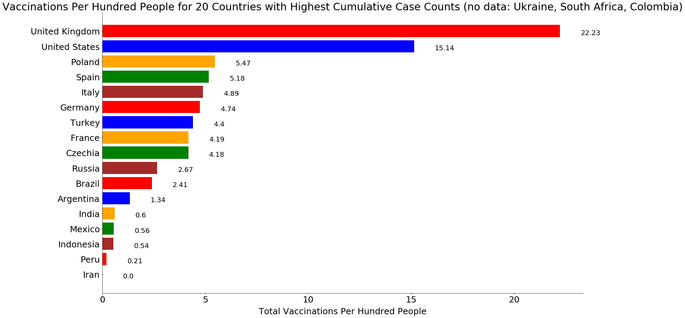
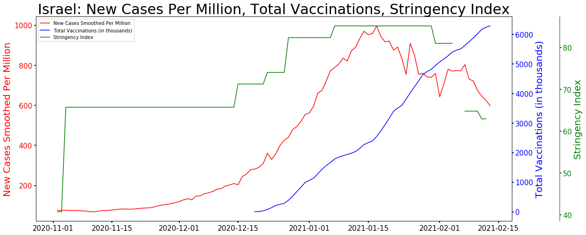
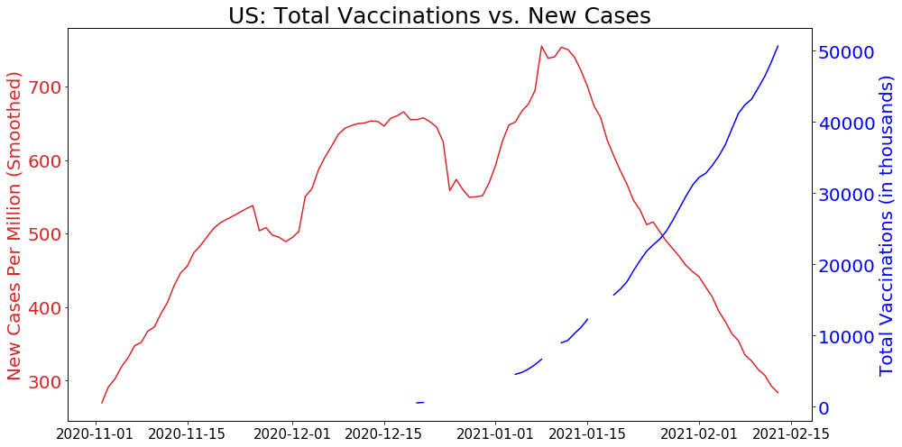

# Covid-19 Data Exploration


```python
# As of February 5, 2021
```


```python
### Data source: John Hopkins University, OneWorldInData
```


```python
import pandas as pd
```


```python
import numpy as np
```


```python
import matplotlib as mlib
```


```python
import matplotlib.pyplot as plt
%matplotlib inline
```


```python
data = pd.read_csv('/Users/sz/Desktop/Desktop-Docs/DataAnalytics/My-Projects/Covid/owid-covid-data205.csv', header =0)
```

## Data Profile


```python
data.describe()
```


<div>
<style scoped>
    .dataframe tbody tr th:only-of-type {
        vertical-align: middle;
    }

    .dataframe tbody tr th {
        vertical-align: top;
    }

    .dataframe thead th {
        text-align: right;
    }
</style>
<table border="1" class="dataframe">
  <thead>
    <tr style="text-align: right;">
      <th></th>
      <th>total_cases</th>
      <th>new_cases</th>
      <th>new_cases_smoothed</th>
      <th>total_deaths</th>
      <th>new_deaths</th>
      <th>new_deaths_smoothed</th>
      <th>total_cases_per_million</th>
      <th>new_cases_per_million</th>
      <th>new_cases_smoothed_per_million</th>
      <th>total_deaths_per_million</th>
      <th>...</th>
      <th>gdp_per_capita</th>
      <th>extreme_poverty</th>
      <th>cardiovasc_death_rate</th>
      <th>diabetes_prevalence</th>
      <th>female_smokers</th>
      <th>male_smokers</th>
      <th>handwashing_facilities</th>
      <th>hospital_beds_per_thousand</th>
      <th>life_expectancy</th>
      <th>human_development_index</th>
    </tr>
  </thead>
  <tbody>
    <tr>
      <th>count</th>
      <td>6.635600e+04</td>
      <td>66354.000000</td>
      <td>65353.000000</td>
      <td>5.753000e+04</td>
      <td>57688.000000</td>
      <td>65353.000000</td>
      <td>63387.000000</td>
      <td>63380.000000</td>
      <td>62426.000000</td>
      <td>54728.000000</td>
      <td>...</td>
      <td>61267.000000</td>
      <td>41923.000000</td>
      <td>61892.000000</td>
      <td>62619.000000</td>
      <td>48806.000000</td>
      <td>48137.000000</td>
      <td>31027.000000</td>
      <td>56809.00000</td>
      <td>63664.000000</td>
      <td>61544.000000</td>
    </tr>
    <tr>
      <th>mean</th>
      <td>5.269616e+05</td>
      <td>5033.168686</td>
      <td>5037.098086</td>
      <td>1.654426e+04</td>
      <td>128.065716</td>
      <td>110.874822</td>
      <td>6074.245022</td>
      <td>61.784679</td>
      <td>61.663292</td>
      <td>147.372649</td>
      <td>...</td>
      <td>19135.297555</td>
      <td>13.206223</td>
      <td>256.697326</td>
      <td>7.775345</td>
      <td>10.570761</td>
      <td>32.648230</td>
      <td>51.082211</td>
      <td>3.04047</td>
      <td>73.124476</td>
      <td>0.715365</td>
    </tr>
    <tr>
      <th>std</th>
      <td>3.737753e+06</td>
      <td>32240.645300</td>
      <td>31927.605632</td>
      <td>9.513764e+04</td>
      <td>707.032942</td>
      <td>636.313471</td>
      <td>12296.997480</td>
      <td>167.019163</td>
      <td>139.341607</td>
      <td>271.324044</td>
      <td>...</td>
      <td>19651.407915</td>
      <td>19.894231</td>
      <td>118.180448</td>
      <td>3.907344</td>
      <td>10.415840</td>
      <td>13.458162</td>
      <td>31.771871</td>
      <td>2.47005</td>
      <td>7.546741</td>
      <td>0.153728</td>
    </tr>
    <tr>
      <th>min</th>
      <td>1.000000e+00</td>
      <td>-46076.000000</td>
      <td>-1121.714000</td>
      <td>1.000000e+00</td>
      <td>-1918.000000</td>
      <td>-232.143000</td>
      <td>0.001000</td>
      <td>-2153.437000</td>
      <td>-276.825000</td>
      <td>0.001000</td>
      <td>...</td>
      <td>661.240000</td>
      <td>0.100000</td>
      <td>79.370000</td>
      <td>0.990000</td>
      <td>0.100000</td>
      <td>7.700000</td>
      <td>1.188000</td>
      <td>0.10000</td>
      <td>53.280000</td>
      <td>0.354000</td>
    </tr>
    <tr>
      <th>25%</th>
      <td>6.087500e+02</td>
      <td>1.000000</td>
      <td>5.143000</td>
      <td>3.300000e+01</td>
      <td>0.000000</td>
      <td>0.000000</td>
      <td>114.574000</td>
      <td>0.084000</td>
      <td>0.871250</td>
      <td>4.993000</td>
      <td>...</td>
      <td>4541.795000</td>
      <td>0.500000</td>
      <td>167.295000</td>
      <td>5.290000</td>
      <td>1.900000</td>
      <td>21.600000</td>
      <td>20.859000</td>
      <td>1.30000</td>
      <td>67.440000</td>
      <td>0.590000</td>
    </tr>
    <tr>
      <th>50%</th>
      <td>6.444000e+03</td>
      <td>53.000000</td>
      <td>63.714000</td>
      <td>2.060000e+02</td>
      <td>1.000000</td>
      <td>0.857000</td>
      <td>891.585000</td>
      <td>5.182000</td>
      <td>7.113000</td>
      <td>25.883000</td>
      <td>...</td>
      <td>13111.214000</td>
      <td>2.000000</td>
      <td>242.648000</td>
      <td>7.110000</td>
      <td>6.300000</td>
      <td>31.400000</td>
      <td>49.839000</td>
      <td>2.40000</td>
      <td>74.530000</td>
      <td>0.747000</td>
    </tr>
    <tr>
      <th>75%</th>
      <td>7.120125e+04</td>
      <td>618.000000</td>
      <td>639.857000</td>
      <td>1.972000e+03</td>
      <td>15.000000</td>
      <td>11.286000</td>
      <td>5464.184000</td>
      <td>48.000000</td>
      <td>53.624250</td>
      <td>142.021000</td>
      <td>...</td>
      <td>27216.445000</td>
      <td>21.200000</td>
      <td>325.721000</td>
      <td>10.080000</td>
      <td>19.300000</td>
      <td>41.100000</td>
      <td>83.241000</td>
      <td>4.00000</td>
      <td>78.570000</td>
      <td>0.843000</td>
    </tr>
    <tr>
      <th>max</th>
      <td>1.053926e+08</td>
      <td>858062.000000</td>
      <td>738534.000000</td>
      <td>2.299235e+06</td>
      <td>17882.000000</td>
      <td>14402.429000</td>
      <td>131650.812000</td>
      <td>8652.658000</td>
      <td>2648.773000</td>
      <td>2003.654000</td>
      <td>...</td>
      <td>116935.600000</td>
      <td>77.600000</td>
      <td>724.417000</td>
      <td>30.530000</td>
      <td>44.000000</td>
      <td>78.100000</td>
      <td>98.999000</td>
      <td>13.80000</td>
      <td>86.750000</td>
      <td>0.953000</td>
    </tr>
  </tbody>
</table>
<p>8 rows × 54 columns</p>
</div>


```python
data.info()
```

    <class 'pandas.core.frame.DataFrame'>
    RangeIndex: 66967 entries, 0 to 66966
    Data columns (total 59 columns):
     #   Column                                 Non-Null Count  Dtype  
    ---  ------                                 --------------  -----  
     0   iso_code                               63993 non-null  object 
     1   continent                              63612 non-null  object 
     2   location                               66967 non-null  object 
     3   date                                   66967 non-null  object 
     4   total_cases                            66356 non-null  float64
     5   new_cases                              66354 non-null  float64
     6   new_cases_smoothed                     65353 non-null  float64
     7   total_deaths                           57530 non-null  float64
     8   new_deaths                             57688 non-null  float64
     9   new_deaths_smoothed                    65353 non-null  float64
     10  total_cases_per_million                63387 non-null  float64
     11  new_cases_per_million                  63380 non-null  float64
     12  new_cases_smoothed_per_million         62426 non-null  float64
     13  total_deaths_per_million               54728 non-null  float64
     14  new_deaths_per_million                 54727 non-null  float64
     15  new_deaths_smoothed_per_million        62426 non-null  float64
     16  reproduction_rate                      51295 non-null  float64
     17  icu_patients                           7167 non-null   float64
     18  icu_patients_per_million               7167 non-null   float64
     19  hosp_patients                          8519 non-null   float64
     20  hosp_patients_per_million              8519 non-null   float64
     21  weekly_icu_admissions                  672 non-null    float64
     22  weekly_icu_admissions_per_million      672 non-null    float64
     23  weekly_hosp_admissions                 1112 non-null   float64
     24  weekly_hosp_admissions_per_million     1112 non-null   float64
     25  new_tests                              30556 non-null  float64
     26  total_tests                            30344 non-null  float64
     27  total_tests_per_thousand               30344 non-null  float64
     28  new_tests_per_thousand                 30556 non-null  float64
     29  new_tests_smoothed                     34427 non-null  float64
     30  new_tests_smoothed_per_thousand        34427 non-null  float64
     31  positive_rate                          32574 non-null  float64
     32  tests_per_case                         32050 non-null  float64
     33  tests_units                            35664 non-null  object 
     34  total_vaccinations                     1458 non-null   float64
     35  people_vaccinated                      1201 non-null   float64
     36  people_fully_vaccinated                657 non-null    float64
     37  new_vaccinations                       1214 non-null   float64
     38  new_vaccinations_smoothed              2029 non-null   float64
     39  total_vaccinations_per_hundred         1458 non-null   float64
     40  people_vaccinated_per_hundred          1201 non-null   float64
     41  people_fully_vaccinated_per_hundred    657 non-null    float64
     42  new_vaccinations_smoothed_per_million  2029 non-null   float64
     43  stringency_index                       57540 non-null  float64
     44  population                             63993 non-null  float64
     45  population_density                     62641 non-null  float64
     46  median_age                             61219 non-null  float64
     47  aged_65_older                          60511 non-null  float64
     48  aged_70_older                          60873 non-null  float64
     49  gdp_per_capita                         61267 non-null  float64
     50  extreme_poverty                        41923 non-null  float64
     51  cardiovasc_death_rate                  61892 non-null  float64
     52  diabetes_prevalence                    62619 non-null  float64
     53  female_smokers                         48806 non-null  float64
     54  male_smokers                           48137 non-null  float64
     55  handwashing_facilities                 31027 non-null  float64
     56  hospital_beds_per_thousand             56809 non-null  float64
     57  life_expectancy                        63664 non-null  float64
     58  human_development_index                61544 non-null  float64
    dtypes: float64(54), object(5)
    memory usage: 30.1+ MB


# change data type to date


```python
import datetime as dt
```


```python
data['date']=pd.to_datetime(data['date'], format='%Y/%m/%d')
```


```python
data['date'].min()
```


    Timestamp('2020-01-01 00:00:00')


```python
data['date'].max()
```


    Timestamp('2021-02-05 00:00:00')


## check duplicated entries 


```python
data.duplicated().sum()
```


    0


## check unique values


```python
data['location'].unique()
```


    array(['Afghanistan', 'Africa', 'Albania', 'Algeria', 'Andorra', 'Angola',
           'Antigua and Barbuda', 'Argentina', 'Armenia', 'Asia', 'Australia',
           'Austria', 'Azerbaijan', 'Bahamas', 'Bahrain', 'Bangladesh',
           'Barbados', 'Belarus', 'Belgium', 'Belize', 'Benin', 'Bhutan',
           'Bolivia', 'Bosnia and Herzegovina', 'Botswana', 'Brazil',
           'Brunei', 'Bulgaria', 'Burkina Faso', 'Burundi', 'Cambodia',
           'Cameroon', 'Canada', 'Cape Verde', 'Central African Republic',
           'Chad', 'Chile', 'China', 'Colombia', 'Comoros', 'Congo',
           'Costa Rica', "Cote d'Ivoire", 'Croatia', 'Cuba', 'Cyprus',
           'Czechia', 'Democratic Republic of Congo', 'Denmark', 'Djibouti',
           'Dominica', 'Dominican Republic', 'Ecuador', 'Egypt',
           'El Salvador', 'Equatorial Guinea', 'Eritrea', 'Estonia',
           'Eswatini', 'Ethiopia', 'Europe', 'European Union', 'Fiji',
           'Finland', 'France', 'Gabon', 'Gambia', 'Georgia', 'Germany',
           'Ghana', 'Greece', 'Grenada', 'Guatemala', 'Guinea',
           'Guinea-Bissau', 'Guyana', 'Haiti', 'Honduras', 'Hong Kong',
           'Hungary', 'Iceland', 'India', 'Indonesia', 'International',
           'Iran', 'Iraq', 'Ireland', 'Israel', 'Italy', 'Jamaica', 'Japan',
           'Jordan', 'Kazakhstan', 'Kenya', 'Kosovo', 'Kuwait', 'Kyrgyzstan',
           'Laos', 'Latvia', 'Lebanon', 'Lesotho', 'Liberia', 'Libya',
           'Liechtenstein', 'Lithuania', 'Luxembourg', 'Madagascar', 'Malawi',
           'Malaysia', 'Maldives', 'Mali', 'Malta', 'Marshall Islands',
           'Mauritania', 'Mauritius', 'Mexico', 'Micronesia (country)',
           'Moldova', 'Monaco', 'Mongolia', 'Montenegro', 'Morocco',
           'Mozambique', 'Myanmar', 'Namibia', 'Nepal', 'Netherlands',
           'New Zealand', 'Nicaragua', 'Niger', 'Nigeria', 'North America',
           'North Macedonia', 'Norway', 'Oceania', 'Oman', 'Pakistan',
           'Palestine', 'Panama', 'Papua New Guinea', 'Paraguay', 'Peru',
           'Philippines', 'Poland', 'Portugal', 'Qatar', 'Romania', 'Russia',
           'Rwanda', 'Saint Kitts and Nevis', 'Saint Lucia',
           'Saint Vincent and the Grenadines', 'Samoa', 'San Marino',
           'Sao Tome and Principe', 'Saudi Arabia', 'Senegal', 'Serbia',
           'Seychelles', 'Sierra Leone', 'Singapore', 'Slovakia', 'Slovenia',
           'Solomon Islands', 'Somalia', 'South Africa', 'South America',
           'South Korea', 'South Sudan', 'Spain', 'Sri Lanka', 'Sudan',
           'Suriname', 'Sweden', 'Switzerland', 'Syria', 'Taiwan',
           'Tajikistan', 'Tanzania', 'Thailand', 'Timor', 'Togo',
           'Trinidad and Tobago', 'Tunisia', 'Turkey', 'Uganda', 'Ukraine',
           'United Arab Emirates', 'United Kingdom', 'United States',
           'Uruguay', 'Uzbekistan', 'Vanuatu', 'Vatican', 'Venezuela',
           'Vietnam', 'World', 'Yemen', 'Zambia', 'Zimbabwe'], dtype=object)


## check na percentages


```python
data.isna().sum()/len(data)*100
```


    iso_code                                  4.440993
    continent                                 5.009930
    location                                  0.000000
    date                                      0.000000
    total_cases                               0.912390
    new_cases                                 0.915376
    new_cases_smoothed                        2.410142
    total_deaths                             14.092015
    new_deaths                               13.856078
    new_deaths_smoothed                       2.410142
    total_cases_per_million                   5.345917
    new_cases_per_million                     5.356370
    new_cases_smoothed_per_million            6.780952
    total_deaths_per_million                 18.276166
    new_deaths_per_million                   18.277659
    new_deaths_smoothed_per_million           6.780952
    reproduction_rate                        23.402571
    icu_patients                             89.297714
    icu_patients_per_million                 89.297714
    hosp_patients                            87.278809
    hosp_patients_per_million                87.278809
    weekly_icu_admissions                    98.996521
    weekly_icu_admissions_per_million        98.996521
    weekly_hosp_admissions                   98.339481
    weekly_hosp_admissions_per_million       98.339481
    new_tests                                54.371556
    total_tests                              54.688130
    total_tests_per_thousand                 54.688130
    new_tests_per_thousand                   54.371556
    new_tests_smoothed                       48.591097
    new_tests_smoothed_per_thousand          48.591097
    positive_rate                            51.358132
    tests_per_case                           52.140607
    tests_units                              46.743919
    total_vaccinations                       97.822808
    people_vaccinated                        98.206579
    people_fully_vaccinated                  99.018920
    new_vaccinations                         98.187167
    new_vaccinations_smoothed                96.970149
    total_vaccinations_per_hundred           97.822808
    people_vaccinated_per_hundred            98.206579
    people_fully_vaccinated_per_hundred      99.018920
    new_vaccinations_smoothed_per_million    96.970149
    stringency_index                         14.077083
    population                                4.440993
    population_density                        6.459898
    median_age                                8.583332
    aged_65_older                             9.640569
    aged_70_older                             9.100004
    gdp_per_capita                            8.511655
    extreme_poverty                          37.397524
    cardiovasc_death_rate                     7.578359
    diabetes_prevalence                       6.492750
    female_smokers                           27.119327
    male_smokers                             28.118327
    handwashing_facilities                   53.668225
    hospital_beds_per_thousand               15.168665
    life_expectancy                           4.932280
    human_development_index                   8.098018
    dtype: float64


# Exploratory Analysis

# Top 20 countries with highest case numbers 


```python
sorted = data.loc[data['date']==data['date'].max(), ['date','location', 'total_cases']].sort_values(by ='total_cases', ascending = False)
```


```python
sorted.head(21)
```


<div>
<style scoped>
    .dataframe tbody tr th:only-of-type {
        vertical-align: middle;
    }

    .dataframe tbody tr th {
        vertical-align: top;
    }

    .dataframe thead th {
        text-align: right;
    }
</style>
<table border="1" class="dataframe">
  <thead>
    <tr style="text-align: right;">
      <th></th>
      <th>date</th>
      <th>location</th>
      <th>total_cases</th>
    </tr>
  </thead>
  <tbody>
    <tr>
      <th>66016</th>
      <td>2021-02-05</td>
      <td>World</td>
      <td>105392577.0</td>
    </tr>
    <tr>
      <th>20808</th>
      <td>2021-02-05</td>
      <td>Europe</td>
      <td>31229534.0</td>
    </tr>
    <tr>
      <th>44323</th>
      <td>2021-02-05</td>
      <td>North America</td>
      <td>30741635.0</td>
    </tr>
    <tr>
      <th>63843</th>
      <td>2021-02-05</td>
      <td>United States</td>
      <td>26813772.0</td>
    </tr>
    <tr>
      <th>3519</th>
      <td>2021-02-05</td>
      <td>Asia</td>
      <td>23466403.0</td>
    </tr>
    <tr>
      <th>21188</th>
      <td>2021-02-05</td>
      <td>European Union</td>
      <td>20265211.0</td>
    </tr>
    <tr>
      <th>55832</th>
      <td>2021-02-05</td>
      <td>South America</td>
      <td>16277157.0</td>
    </tr>
    <tr>
      <th>27827</th>
      <td>2021-02-05</td>
      <td>India</td>
      <td>10814304.0</td>
    </tr>
    <tr>
      <th>8951</th>
      <td>2021-02-05</td>
      <td>Brazil</td>
      <td>9447165.0</td>
    </tr>
    <tr>
      <th>63462</th>
      <td>2021-02-05</td>
      <td>United Kingdom</td>
      <td>3922910.0</td>
    </tr>
    <tr>
      <th>49878</th>
      <td>2021-02-05</td>
      <td>Russia</td>
      <td>3891274.0</td>
    </tr>
    <tr>
      <th>706</th>
      <td>2021-02-05</td>
      <td>Africa</td>
      <td>3644992.0</td>
    </tr>
    <tr>
      <th>22314</th>
      <td>2021-02-05</td>
      <td>France</td>
      <td>3355678.0</td>
    </tr>
    <tr>
      <th>56892</th>
      <td>2021-02-05</td>
      <td>Spain</td>
      <td>2941990.0</td>
    </tr>
    <tr>
      <th>30301</th>
      <td>2021-02-05</td>
      <td>Italy</td>
      <td>2611659.0</td>
    </tr>
    <tr>
      <th>62054</th>
      <td>2021-02-05</td>
      <td>Turkey</td>
      <td>2516889.0</td>
    </tr>
    <tr>
      <th>23691</th>
      <td>2021-02-05</td>
      <td>Germany</td>
      <td>2276371.0</td>
    </tr>
    <tr>
      <th>13397</th>
      <td>2021-02-05</td>
      <td>Colombia</td>
      <td>2142660.0</td>
    </tr>
    <tr>
      <th>2796</th>
      <td>2021-02-05</td>
      <td>Argentina</td>
      <td>1970009.0</td>
    </tr>
    <tr>
      <th>39197</th>
      <td>2021-02-05</td>
      <td>Mexico</td>
      <td>1912871.0</td>
    </tr>
    <tr>
      <th>48471</th>
      <td>2021-02-05</td>
      <td>Poland</td>
      <td>1539564.0</td>
    </tr>
  </tbody>
</table>
</div>


## bar charts

## create value series


```python
top_20_countries = sorted['location'][1:].head(20)
top_20_cases = round(sorted['total_cases'][1:].head(20)/1000, 2)
```

## create bar chart


```python
fig,ax = plt.subplots(figsize = (35,15))
rect = ax.barh(top_20_countries, top_20_cases, align = 'center', color = ['red', 'blue','orange','green', 'brown'])
ax.set_title("20 Countries with Highest Cumulative Covid-19 Cases", fontsize = 30)
ax.set_xlabel('Case Numbers in Thousands', fontsize = 25)
ax.invert_yaxis()
ax.tick_params(axis='y', labelsize = 25)
ax.tick_params(axis='x', labelsize =25)

# format x axis label value in thousands
ax.get_xaxis().set_major_formatter(mlib.ticker.FuncFormatter(lambda x, p: format(int(x), ',')))

```


    

    


```python
data.loc[data['location'].isin(['United States']), ['date', 'total_cases']]
```


<div>
<style scoped>
    .dataframe tbody tr th:only-of-type {
        vertical-align: middle;
    }

    .dataframe tbody tr th {
        vertical-align: top;
    }

    .dataframe thead th {
        text-align: right;
    }
</style>
<table border="1" class="dataframe">
  <thead>
    <tr style="text-align: right;">
      <th></th>
      <th>date</th>
      <th>total_cases</th>
    </tr>
  </thead>
  <tbody>
    <tr>
      <th>63463</th>
      <td>2020-01-22</td>
      <td>1.0</td>
    </tr>
    <tr>
      <th>63464</th>
      <td>2020-01-23</td>
      <td>1.0</td>
    </tr>
    <tr>
      <th>63465</th>
      <td>2020-01-24</td>
      <td>2.0</td>
    </tr>
    <tr>
      <th>63466</th>
      <td>2020-01-25</td>
      <td>2.0</td>
    </tr>
    <tr>
      <th>63467</th>
      <td>2020-01-26</td>
      <td>5.0</td>
    </tr>
    <tr>
      <th>...</th>
      <td>...</td>
      <td>...</td>
    </tr>
    <tr>
      <th>63839</th>
      <td>2021-02-01</td>
      <td>26321120.0</td>
    </tr>
    <tr>
      <th>63840</th>
      <td>2021-02-02</td>
      <td>26435557.0</td>
    </tr>
    <tr>
      <th>63841</th>
      <td>2021-02-03</td>
      <td>26557026.0</td>
    </tr>
    <tr>
      <th>63842</th>
      <td>2021-02-04</td>
      <td>26680214.0</td>
    </tr>
    <tr>
      <th>63843</th>
      <td>2021-02-05</td>
      <td>26813772.0</td>
    </tr>
  </tbody>
</table>
<p>381 rows × 2 columns</p>
</div>


# Top 20 countries with highest cumulative infection rates


```python
sorted_pop = data.loc[data['date']==data['date'].max(), ['date', 'location','total_cases', 'population']]
```


```python
sorted_pop['rate'] = round(sorted_pop['total_cases']/sorted_pop['population']*100,2)
```


```python
sorted_pop.sort_values(by='rate', ascending = False).head(20)
```


<div>
<style scoped>
    .dataframe tbody tr th:only-of-type {
        vertical-align: middle;
    }

    .dataframe tbody tr th {
        vertical-align: top;
    }

    .dataframe thead th {
        text-align: right;
    }
</style>
<table border="1" class="dataframe">
  <thead>
    <tr style="text-align: right;">
      <th></th>
      <th>date</th>
      <th>location</th>
      <th>total_cases</th>
      <th>population</th>
      <th>rate</th>
    </tr>
  </thead>
  <tbody>
    <tr>
      <th>1741</th>
      <td>2021-02-05</td>
      <td>Andorra</td>
      <td>10172.0</td>
      <td>77265.0</td>
      <td>13.17</td>
    </tr>
    <tr>
      <th>40550</th>
      <td>2021-02-05</td>
      <td>Montenegro</td>
      <td>64168.0</td>
      <td>628062.0</td>
      <td>10.22</td>
    </tr>
    <tr>
      <th>16034</th>
      <td>2021-02-05</td>
      <td>Czechia</td>
      <td>1021477.0</td>
      <td>10708982.0</td>
      <td>9.54</td>
    </tr>
    <tr>
      <th>51608</th>
      <td>2021-02-05</td>
      <td>San Marino</td>
      <td>3111.0</td>
      <td>33938.0</td>
      <td>9.17</td>
    </tr>
    <tr>
      <th>54673</th>
      <td>2021-02-05</td>
      <td>Slovenia</td>
      <td>172299.0</td>
      <td>2078932.0</td>
      <td>8.29</td>
    </tr>
    <tr>
      <th>36006</th>
      <td>2021-02-05</td>
      <td>Luxembourg</td>
      <td>51512.0</td>
      <td>625976.0</td>
      <td>8.23</td>
    </tr>
    <tr>
      <th>63843</th>
      <td>2021-02-05</td>
      <td>United States</td>
      <td>26813772.0</td>
      <td>331002647.0</td>
      <td>8.10</td>
    </tr>
    <tr>
      <th>29929</th>
      <td>2021-02-05</td>
      <td>Israel</td>
      <td>680856.0</td>
      <td>8655541.0</td>
      <td>7.87</td>
    </tr>
    <tr>
      <th>46763</th>
      <td>2021-02-05</td>
      <td>Panama</td>
      <td>325487.0</td>
      <td>4314768.0</td>
      <td>7.54</td>
    </tr>
    <tr>
      <th>48817</th>
      <td>2021-02-05</td>
      <td>Portugal</td>
      <td>755774.0</td>
      <td>10196707.0</td>
      <td>7.41</td>
    </tr>
    <tr>
      <th>35658</th>
      <td>2021-02-05</td>
      <td>Lithuania</td>
      <td>185601.0</td>
      <td>2722291.0</td>
      <td>6.82</td>
    </tr>
    <tr>
      <th>35314</th>
      <td>2021-02-05</td>
      <td>Liechtenstein</td>
      <td>2518.0</td>
      <td>38137.0</td>
      <td>6.60</td>
    </tr>
    <tr>
      <th>23315</th>
      <td>2021-02-05</td>
      <td>Georgia</td>
      <td>261018.0</td>
      <td>3989175.0</td>
      <td>6.54</td>
    </tr>
    <tr>
      <th>56892</th>
      <td>2021-02-05</td>
      <td>Spain</td>
      <td>2941990.0</td>
      <td>46754783.0</td>
      <td>6.29</td>
    </tr>
    <tr>
      <th>5260</th>
      <td>2021-02-05</td>
      <td>Bahrain</td>
      <td>106198.0</td>
      <td>1701583.0</td>
      <td>6.24</td>
    </tr>
    <tr>
      <th>6638</th>
      <td>2021-02-05</td>
      <td>Belgium</td>
      <td>721432.0</td>
      <td>11589616.0</td>
      <td>6.22</td>
    </tr>
    <tr>
      <th>58678</th>
      <td>2021-02-05</td>
      <td>Switzerland</td>
      <td>531873.0</td>
      <td>8654618.0</td>
      <td>6.15</td>
    </tr>
    <tr>
      <th>52945</th>
      <td>2021-02-05</td>
      <td>Serbia</td>
      <td>404668.0</td>
      <td>6804596.0</td>
      <td>5.95</td>
    </tr>
    <tr>
      <th>42607</th>
      <td>2021-02-05</td>
      <td>Netherlands</td>
      <td>1011636.0</td>
      <td>17134873.0</td>
      <td>5.90</td>
    </tr>
    <tr>
      <th>58299</th>
      <td>2021-02-05</td>
      <td>Sweden</td>
      <td>588062.0</td>
      <td>10099270.0</td>
      <td>5.82</td>
    </tr>
  </tbody>
</table>
</div>


```python
sorted_result=sorted_pop.sort_values(by='rate', ascending = False).head(20)
```


```python
top_20rate_countries=sorted_result['location']
top_20rate_values = sorted_result['rate']
```


```python
fig,ax = plt.subplots(figsize=(25,15))
ax.barh(top_20rate_countries, top_20rate_values,color = ['red', 'blue','orange','green', 'brown'])
ax.set_title("20 Countries with Highest Cumulative Covid-19 Infection Rates", fontsize = 25)
ax.set_ylabel('Cumulative Infection Rates in Percentage', fontsize = 20)
ax.tick_params(axis='y', labelsize = 20)
ax.invert_yaxis()
ax.spines['top'].set_visible(False) # remove spines for better visual effects
ax.spines['right'].set_visible(False)
ax.spines['bottom'].set_visible(True)
ax.xaxis.set_ticklabels([]) #remove spine tick labels
ax.xaxis.set_ticks([]) #remove spine ticks

for i,v in enumerate(top_20rate_values):
    ax.text(v+0.25,i+0.25,str(v)+'%', fontsize = 20, ha = 'left', va = 'center')

```


    

    


# Top 20 countries of vaccinations


```python
total_vac = data[['date','location','total_vaccinations', 'new_cases_smoothed_per_million', 'stringency_index']]
```


```python
top_vac = total_vac.loc[total_vac['date']== total_vac['date'].max(), ['date', 'location', 'total_vaccinations']]
```


```python
top_vac_sorted = top_vac.sort_values(by = 'total_vaccinations', ascending = False).head(22) #world and EU are in top 20/
```


```python
exl = ['World', 'European Union']
top_vac_20 = top_vac_sorted.loc[~top_vac_sorted['location'].isin(exl)]
top_vac_20

```


<div>
<style scoped>
    .dataframe tbody tr th:only-of-type {
        vertical-align: middle;
    }

    .dataframe tbody tr th {
        vertical-align: top;
    }

    .dataframe thead th {
        text-align: right;
    }
</style>
<table border="1" class="dataframe">
  <thead>
    <tr style="text-align: right;">
      <th></th>
      <th>date</th>
      <th>location</th>
      <th>total_vaccinations</th>
    </tr>
  </thead>
  <tbody>
    <tr>
      <th>63843</th>
      <td>2021-02-05</td>
      <td>United States</td>
      <td>36819212.0</td>
    </tr>
    <tr>
      <th>27827</th>
      <td>2021-02-05</td>
      <td>India</td>
      <td>5416849.0</td>
    </tr>
    <tr>
      <th>29929</th>
      <td>2021-02-05</td>
      <td>Israel</td>
      <td>5376768.0</td>
    </tr>
    <tr>
      <th>23691</th>
      <td>2021-02-05</td>
      <td>Germany</td>
      <td>3116122.0</td>
    </tr>
    <tr>
      <th>8951</th>
      <td>2021-02-05</td>
      <td>Brazil</td>
      <td>3074906.0</td>
    </tr>
    <tr>
      <th>62054</th>
      <td>2021-02-05</td>
      <td>Turkey</td>
      <td>2559802.0</td>
    </tr>
    <tr>
      <th>30301</th>
      <td>2021-02-05</td>
      <td>Italy</td>
      <td>2435489.0</td>
    </tr>
    <tr>
      <th>48471</th>
      <td>2021-02-05</td>
      <td>Poland</td>
      <td>1617764.0</td>
    </tr>
    <tr>
      <th>11355</th>
      <td>2021-02-05</td>
      <td>Canada</td>
      <td>1042171.0</td>
    </tr>
    <tr>
      <th>28168</th>
      <td>2021-02-05</td>
      <td>Indonesia</td>
      <td>865609.0</td>
    </tr>
    <tr>
      <th>49506</th>
      <td>2021-02-05</td>
      <td>Romania</td>
      <td>821552.0</td>
    </tr>
    <tr>
      <th>39197</th>
      <td>2021-02-05</td>
      <td>Mexico</td>
      <td>700316.0</td>
    </tr>
    <tr>
      <th>12679</th>
      <td>2021-02-05</td>
      <td>Chile</td>
      <td>569886.0</td>
    </tr>
    <tr>
      <th>52945</th>
      <td>2021-02-05</td>
      <td>Serbia</td>
      <td>538373.0</td>
    </tr>
    <tr>
      <th>6638</th>
      <td>2021-02-05</td>
      <td>Belgium</td>
      <td>410505.0</td>
    </tr>
    <tr>
      <th>40915</th>
      <td>2021-02-05</td>
      <td>Morocco</td>
      <td>408235.0</td>
    </tr>
    <tr>
      <th>24370</th>
      <td>2021-02-05</td>
      <td>Greece</td>
      <td>380136.0</td>
    </tr>
    <tr>
      <th>42607</th>
      <td>2021-02-05</td>
      <td>Netherlands</td>
      <td>356517.0</td>
    </tr>
    <tr>
      <th>58299</th>
      <td>2021-02-05</td>
      <td>Sweden</td>
      <td>343872.0</td>
    </tr>
    <tr>
      <th>16034</th>
      <td>2021-02-05</td>
      <td>Czechia</td>
      <td>343269.0</td>
    </tr>
  </tbody>
</table>
</div>


```python
top_vac_values = top_vac_20['total_vaccinations'].astype(int)
top_vac_countries= top_vac_20['location']
```


```python
fig,ax = plt.subplots(figsize = (25,15))
rect = ax.barh(top_vac_countries, top_vac_values, color = ['red', 'blue','orange','green', 'brown'])

ax.set_title("20 Countries with Highest Total Vaccinations", fontsize = 25)
ax.set_xlabel('Total Vaccinations', labelpad = 10, fontsize = 25)
ax.tick_params(axis= 'y', labelsize = 25)
ax.tick_params(axis='x', labelsize =25)
ax.invert_yaxis()
# remove spines for better visual effects
ax.spines['right'].set_visible(False)
ax.spines['top'].set_visible(False)

# format x axis label value in thousands
ax.get_xaxis().set_major_formatter(mlib.ticker.FuncFormatter(lambda x, p: format(int(x), ',')))

# show bar values, format values with ','
for i,v in enumerate(top_vac_values):
    ax.text(v+1, i+0.25, str(format(v,',')), fontsize = 20)
```


    

    


```python
## Top countries with vaccinations per 100 people
```


```python
total_vac_per100 = data[['date','location', 'total_vaccinations_per_hundred']]
total_vac_per100_lt = total_vac_per100.loc[total_vac_per100['date']==total_vac_per100['date'].max(), \
                                           ['location', 'total_vaccinations_per_hundred']]
vac_per100_sorted = total_vac_per100_lt.sort_values(by = 'total_vaccinations_per_hundred', ascending = False)
```


```python
top_vac_per100 = vac_per100_sorted.head(21)
top_vac_per100 = top_vac_per100[top_vac_per100['location'] !='European Union']
len(top_vac_per100)
```


    20


```python
top_vac_per100_values = top_vac_per100['total_vaccinations_per_hundred']
top_vac_per100_countries = top_vac_per100['location']
```


```python
fig,ax = plt.subplots(figsize = (25,15))
rect = ax.barh(top_vac_per100_countries, top_vac_per100_values, color = ['red', 'blue','orange','green', 'brown'])

ax.set_title("20 Countries with Highest Total Vaccinations Per Hundred People", fontsize = 25)
ax.set_xlabel('Total Vaccinations Per Hundred People', labelpad = 10, fontsize = 25)
ax.tick_params(axis= 'y', labelsize = 25)
ax.tick_params(axis='x', labelsize =25)
ax.invert_yaxis()
# remove spines for better visual effects
ax.spines['right'].set_visible(False)
ax.spines['top'].set_visible(False)

# format x axis label value in thousands
ax.get_xaxis().set_major_formatter(mlib.ticker.FuncFormatter(lambda x, p: format(int(x), ',')))

# show bar values, format values with ','
for i,v in enumerate(top_vac_per100_values):
    ax.text(v+1, i+0.25, str(format(v,',')), fontsize = 20)
```


    

    


# Israel Covid-19 trend after vaccinations


```python
Israel=total_vac.loc[total_vac['location'].isin(['Israel'])]
```


```python
Israel_vac = Israel[Israel['date']>'2020/11/1']

```


```python
fig, ax = plt.subplots(figsize=(14,7))
color = 'red'

ax.set_ylabel('New Cases Per Million (Smoothed)', color=color, fontsize = 20)
ax.plot(Israel_vac['date'], Israel_vac['new_cases_smoothed_per_million'], color = color)
ax.tick_params(axis='y', labelcolor=color, labelsize =20)
ax.tick_params(axis='x', labelsize=15)
ax.set_title('Israel: Total Vaccinations vs. New Cases', fontsize=25)

ax2 = ax.twinx()  # instantiate a second axes that shares the same x-axis

color = 'blue'
ax2.set_ylabel('Total Vaccinations (in thousands)', color=color, fontsize =20)  # we already handled the x-label with ax1
ax2.plot(Israel_vac['date'], Israel_vac['total_vaccinations']/1000, color=color)
ax2.tick_params(axis='y', labelcolor=color, labelsize =20)

fig.tight_layout()  # otherwise the right y-label is slightly clipped
plt.show()
```


    

    


# Israel New Cases vs. Government Stringency (Restrictions) Index


```python
fig, ax = plt.subplots(figsize=(14,7))
color = 'red'
ax.set_ylabel('New Cases Per Million (Smoothed)', color=color, fontsize = 20)
ax.plot(Israel_vac['date'], Israel_vac['new_cases_smoothed_per_million'], color = color)
ax.tick_params(axis='y', labelcolor=color, labelsize =20)
ax.tick_params(axis = 'x', labelsize =15)
ax.set_title('Israel: New Cases vs. Government Stringency Index', fontsize=25)

ax2 = ax.twinx()  # instantiate a second axes that shares the same x-axis

color = 'blue'
ax2.set_ylabel('Stringency Index', color=color, fontsize =20)  # we already handled the x-label with ax1
ax2.plot(Israel_vac['date'], Israel_vac['stringency_index'], color=color)
ax2.tick_params(axis='y', labelcolor=color, labelsize =20)

fig.tight_layout()  # otherwise the right y-label is slightly clipped
plt.show()
```


    

    


# Israel: New Cases, Total Vaccinations, and Stringency Index Combined


```python
def make_patch_spines_invisible(ax):
    ax.set_frame_on(True) # ax's rectangular patch is drawn (bool)
    ax.patch.set_visible(False)
    for sp in ax.spines.values():
        sp.set_visible(False)


fig, host = plt.subplots(figsize = (16,8))
fig.subplots_adjust(right = 1)

par1 = host.twinx()# twinx(): share x axis with one invisible, and set y axis on the right side
par2 = host.twinx()

# Offset the right spine of par2.  The ticks and label have already been
# placed on the right by twinx above.
par2.spines["right"].set_position(("axes", 1.1))
# Having been created by twinx, par2 has its frame off, so the line of its
# detached spine is invisible.  
# First, activate the frame but make the patch and spines invisible.
make_patch_spines_invisible(par2)
# Second, show the right spine.
par2.spines["right"].set_visible(True)

p1, = host.plot(Israel_vac['date'], Israel_vac['new_cases_smoothed_per_million'], "r-", label="New Cases Smoothed Per Million")
p2, = par1.plot(Israel_vac['date'], Israel_vac['total_vaccinations']/1000, "b-", label="Total Vaccinations (in thousands)")
p3, = par2.plot(Israel_vac['date'], Israel_vac['stringency_index'], "g-", label="Stringency Index")


#host.set_xlabel("Date")
host.set_ylabel("New Cases Smoothed Per Million", fontsize = 20)
par1.set_ylabel("Total Vaccinations (in thousands)", fontsize = 20)
par2.set_ylabel("Stringency Index", fontsize = 20)
host.set_title("Israel: New Cases Per Million, Total Vaccinations, Stringency Index", fontsize =30)

host.yaxis.label.set_color(p1.get_color())
par1.yaxis.label.set_color(p2.get_color())
par2.yaxis.label.set_color(p3.get_color())

tkw = dict(size=4, width=2, labelsize = 15)
host.tick_params(axis='y', colors=p1.get_color(), **tkw)
par1.tick_params(axis='y', colors=p2.get_color(), **tkw)
par2.tick_params(axis='y', colors=p3.get_color(), **tkw)
host.tick_params(axis='x', **tkw)

lines = [p1, p2, p3]

host.legend(lines, [l.get_label() for l in lines], loc = 'upper left')

plt.show()
```


    

    


# US Covid-19 trend after vaccinations


```python
US = total_vac.loc[total_vac['location'].isin(['United States'])]
```


```python
US_vac = US[US['date']>'2020/11/01']
```


```python
fig, ax = plt.subplots(figsize=(14,7))
color = 'tab:red'

ax.set_ylabel('New Cases Per Million (Smoothed)', color=color, fontsize = 20)
ax.plot(US_vac['date'], US_vac['new_cases_smoothed_per_million'], color = color)
ax.tick_params(axis='y', labelcolor=color, labelsize = 20)
ax.tick_params(axis = 'x', labelsize = 15)
ax.set_title('US: Total Vaccinations vs. New Cases', fontsize=25)

ax2 = ax.twinx()  # instantiate a second axes that shares the same x-axis

color = 'blue'
ax2.set_ylabel('Total Vaccinations (in thousands)', color=color, fontsize =20)  # we already handled the x-label with ax1
ax2.plot(US_vac['date'], US_vac['total_vaccinations']/1000, color=color)
ax2.tick_params(axis='y', labelcolor=color, labelsize = 20)

fig.tight_layout()  # otherwise the right y-label is slightly clipped
plt.show()
```


    

    


# US New Cases vs. Government Stringency (Restrictions) Index


```python
fig, ax = plt.subplots(figsize=(14,7))
color = 'tab:red'
ax.set_ylabel('New Cases Per Million (Smoothed)', color=color, fontsize = 20)
ax.plot(US_vac['date'], US_vac['new_cases_smoothed_per_million'], color = color)
ax.tick_params(axis='y', labelcolor=color, labelsize = 20)
ax.tick_params(axis='x', labelsize = 15)
ax.set_title('US: New Cases vs. Government Stringency Index', fontsize=25)

ax2 = ax.twinx()  # instantiate a second axes that shares the same x-axis

color = 'blue'
ax2.set_ylabel('Stringency Index', color=color, fontsize =20)  # we already handled the x-label with ax1
ax2.plot(US_vac['date'], US_vac['stringency_index'], color=color)
ax2.tick_params(axis='y', labelcolor=color, labelsize = 20)

fig.tight_layout()  # otherwise the right y-label is slightly clipped
plt.show()
```


    

    


# US: New Cases, Total Vaccinations, and Stringency Index Combined


```python
def make_patch_spines_invisible(ax):
    ax.set_frame_on(True) # ax's rectangular patch is drawn (bool)
    ax.patch.set_visible(False)
    for sp in ax.spines.values():
        sp.set_visible(False)


fig, host = plt.subplots(figsize = (16,8))
fig.subplots_adjust(right = 1)

par1 = host.twinx()# twinx(): share x axis with one invisible, and set y axis on the right side
par2 = host.twinx()

# Offset the right spine of par2.  The ticks and label have already been
# placed on the right by twinx above.
par2.spines["right"].set_position(("axes", 1.1))
# Having been created by twinx, par2 has its frame off, so the line of its
# detached spine is invisible.  
# First, activate the frame but make the patch and spines invisible.
make_patch_spines_invisible(par2)
# Second, show the right spine.
par2.spines["right"].set_visible(True)

p1, = host.plot(US_vac['date'], US_vac['new_cases_smoothed_per_million'], "r-", label="New Cases Smoothed Per Million")
p2, = par1.plot(US_vac['date'], US_vac['total_vaccinations']/1000, "b-", label="Total Vaccinations (in thousands)")
p3, = par2.plot(US_vac['date'], US_vac['stringency_index'], "g-", label="Stringency Index")


#host.set_xlabel("Date")
host.set_ylabel("New Cases Smoothed Per Million", fontsize = 20)
par1.set_ylabel("Total Vaccinations (in thousands)", fontsize = 20)
par2.set_ylabel("Stringency Index", fontsize = 20)
host.set_title("US: New Cases Per Million, Total Vaccinations, Stringency Index", fontsize =30)

host.yaxis.label.set_color(p1.get_color())
par1.yaxis.label.set_color(p2.get_color())
par2.yaxis.label.set_color(p3.get_color())

tkw = dict(size=4, width=2, labelsize = 15)
host.tick_params(axis='y', colors=p1.get_color(), **tkw)
par1.tick_params(axis='y', colors=p2.get_color(), **tkw)
par2.tick_params(axis='y', colors=p3.get_color(), **tkw)
host.tick_params(axis='x', **tkw)

lines = [p1, p2, p3]

host.legend(lines, [l.get_label() for l in lines], loc ='center')

plt.show()
```


    

    


# India Covid-19 trend after vaccinations


```python
India = total_vac.loc[total_vac['location'].isin(['India'])]
```


```python
India_vac = India[India['date']>'2020/11/01']
```


```python
fig, ax = plt.subplots(figsize = (14,7))
color = 'tab:red'

ax.set_ylabel('New Cases Per Million (Smoothed)', color=color, fontsize = 20)
ax.plot(India_vac['date'], India_vac['new_cases_smoothed_per_million'], color = color)
ax.tick_params(axis='y', labelcolor=color, labelsize = 20)
ax.tick_params(axis='x', labelsize = 15)
ax.set_title('India: Total Vaccinations vs. New Cases', fontsize=25)
ax2 = ax.twinx()  # instantiate a second axes that shares the same x-axis

color = 'blue'
ax2.set_ylabel('Total Vaccinations (in thousands)', color=color, fontsize =20)  # we already handled the x-label with ax1
ax2.plot(India_vac['date'], India_vac['total_vaccinations']/1000, color=color)
ax2.tick_params(axis='y', labelcolor=color, labelsize = 20)

fig.tight_layout()  # otherwise the right y-label is slightly clipped
plt.show()
```


    

    


# India: New Cases vs. Government Stringency (Restrictions) Index


```python
fig, ax = plt.subplots(figsize = (14,7))
color = 'tab:red'

ax.set_ylabel('New Cases Per Million (Smoothed)', color=color, fontsize = 20)
ax.plot(India_vac['date'], India_vac['new_cases_smoothed_per_million'], color = color)
ax.tick_params(axis='y', labelcolor=color, labelsize = 20)
ax.tick_params(axis='x', labelsize = 15)
ax.set_title('India: New Cases vs.Government Stringency Index', fontsize=20)

ax2 = ax.twinx()  # instantiate a second axes that shares the same x-axis

color = 'blue'
ax2.set_ylabel('Stringency Index', color=color, fontsize =20)  # we already handled the x-label with ax1
ax2.plot(India_vac['date'], India_vac['stringency_index'], color=color)
ax2.tick_params(axis='y', labelcolor=color, labelsize = 20)

fig.tight_layout()  # otherwise the right y-label is slightly clipped
plt.show()
```


    

    


# India: New Cases, Total Vaccinations, and Stringency Index Combined


```python
def make_patch_spines_invisible(ax):
    ax.set_frame_on(True) # ax's rectangular patch is drawn (bool)
    ax.patch.set_visible(False)
    for sp in ax.spines.values():
        sp.set_visible(False)


fig, host = plt.subplots(figsize = (16,8))
fig.subplots_adjust(right = 1)

par1 = host.twinx()# twinx(): share x axis with one invisible, and set y axis on the right side
par2 = host.twinx()

# Offset the right spine of par2.  The ticks and label have already been
# placed on the right by twinx above.
par2.spines["right"].set_position(("axes", 1.1))
# Having been created by twinx, par2 has its frame off, so the line of its
# detached spine is invisible.  
# First, activate the frame but make the patch and spines invisible.
make_patch_spines_invisible(par2)
# Second, show the right spine.
par2.spines["right"].set_visible(True)

p1, = host.plot(India_vac['date'], India_vac['new_cases_smoothed_per_million'], "r-", label="New Cases Smoothed Per Million")
p2, = par1.plot(India_vac['date'], India_vac['total_vaccinations']/1000, "b-", label="Total Vaccinations (in thousands)")
p3, = par2.plot(India_vac['date'], India_vac['stringency_index'], "g-", label="Stringency Index")


#host.set_xlabel("Date")
host.set_ylabel("New Cases Smoothed Per Million", fontsize = 20)
par1.set_ylabel("Total Vaccinations (in thousands)", fontsize = 20)
par2.set_ylabel("Stringency Index", fontsize = 20)
host.set_title("India: New Cases Per Million, Total Vaccinations, Stringency Index", fontsize =30)

host.yaxis.label.set_color(p1.get_color())
par1.yaxis.label.set_color(p2.get_color())
par2.yaxis.label.set_color(p3.get_color())

tkw = dict(size=4, width=2, labelsize = 15)
host.tick_params(axis='y', colors=p1.get_color(), **tkw)
par1.tick_params(axis='y', colors=p2.get_color(), **tkw)
par2.tick_params(axis='y', colors=p3.get_color(), **tkw)
host.tick_params(axis='x', **tkw)

lines = [p1, p2, p3]

host.legend(lines, [l.get_label() for l in lines], loc = 'lower center')

plt.show()
```


    

    


# Canada Covid-19 Trend After Vaccinations


```python
Canada = total_vac.loc[total_vac['location'].isin(['Canada'])]
Can_vac = Canada[Canada['date']>'2020/11/01']
```


```python
def make_patch_spines_invisible(ax):
    ax.set_frame_on(True) # ax's rectangular patch is drawn (bool)
    ax.patch.set_visible(False)
    for sp in ax.spines.values():
        sp.set_visible(False)


fig, host = plt.subplots(figsize = (16,8))
fig.subplots_adjust(right = 1)

par1 = host.twinx()# twinx(): share x axis with one invisible, and set y axis on the right side
par2 = host.twinx()

# Offset the right spine of par2.  The ticks and label have already been
# placed on the right by twinx above.
par2.spines["right"].set_position(("axes", 1.1))
# Having been created by twinx, par2 has its frame off, so the line of its
# detached spine is invisible.  
# First, activate the frame but make the patch and spines invisible.
make_patch_spines_invisible(par2)
# Second, show the right spine.
par2.spines["right"].set_visible(True)

p1, = host.plot(Can_vac['date'], Can_vac['new_cases_smoothed_per_million'], "r-", label="New Cases Smoothed Per Million")
p2, = par1.plot(Can_vac['date'], Can_vac['total_vaccinations']/1000, "b-", label="Total Vaccinations (in thousands)")
p3, = par2.plot(Can_vac['date'], Can_vac['stringency_index'], "g-", label="Stringency Index")


#host.set_xlabel("Date")
host.set_ylabel("New Cases Smoothed Per Million", fontsize = 20)
par1.set_ylabel("Total Vaccinations (in thousands)", fontsize = 20)
par2.set_ylabel("Stringency Index", fontsize = 20)
host.set_title("Canada: New Cases Per Million, Total Vaccinations, Stringency Index", fontsize =30)

host.yaxis.label.set_color(p1.get_color())
par1.yaxis.label.set_color(p2.get_color())
par2.yaxis.label.set_color(p3.get_color())

tkw = dict(size=4, width=2, labelsize = 15)
host.tick_params(axis='y', colors=p1.get_color(), **tkw)
par1.tick_params(axis='y', colors=p2.get_color(), **tkw)
par2.tick_params(axis='y', colors=p3.get_color(), **tkw)
host.tick_params(axis='x', **tkw)

lines = [p1, p2, p3]

host.legend(lines, [l.get_label() for l in lines], loc ='upper left')

plt.show()
```


    

    


```python

```
