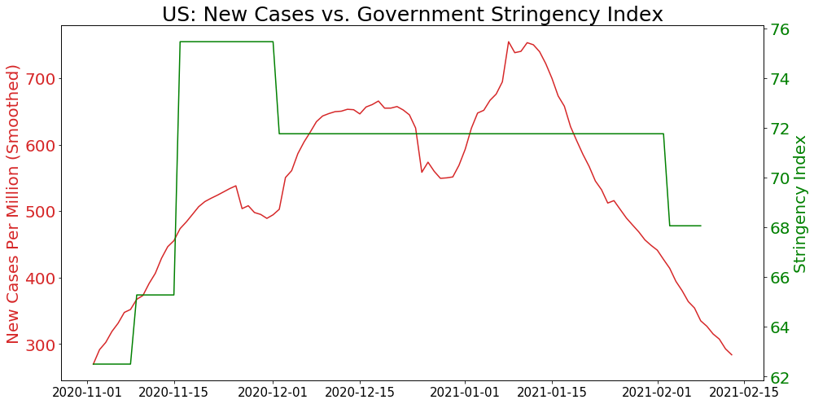

# Covid-19 Data Exploration

# As of February 13, 2021

### Data source: John Hopkins University, Our World In Data


```python
import pandas as pd
```


```python
import numpy as np
```


```python
import matplotlib as mlib
```


```python
import matplotlib.pyplot as plt
%matplotlib inline
```


```python
data = pd.read_csv('/Users/sz/Desktop/Desktop-Docs/DataAnalytics/My-Projects/Covid/owid-covid-data213.csv', header =0)
```

## Data Profile


```python
data.describe()
```


<div>
<style scoped>
    .dataframe tbody tr th:only-of-type {
        vertical-align: middle;
    }

    .dataframe tbody tr th {
        vertical-align: top;
    }

    .dataframe thead th {
        text-align: right;
    }
</style>
<table border="1" class="dataframe">
  <thead>
    <tr style="text-align: right;">
      <th></th>
      <th>total_cases</th>
      <th>new_cases</th>
      <th>new_cases_smoothed</th>
      <th>total_deaths</th>
      <th>new_deaths</th>
      <th>new_deaths_smoothed</th>
      <th>total_cases_per_million</th>
      <th>new_cases_per_million</th>
      <th>new_cases_smoothed_per_million</th>
      <th>total_deaths_per_million</th>
      <th>...</th>
      <th>gdp_per_capita</th>
      <th>extreme_poverty</th>
      <th>cardiovasc_death_rate</th>
      <th>diabetes_prevalence</th>
      <th>female_smokers</th>
      <th>male_smokers</th>
      <th>handwashing_facilities</th>
      <th>hospital_beds_per_thousand</th>
      <th>life_expectancy</th>
      <th>human_development_index</th>
    </tr>
  </thead>
  <tbody>
    <tr>
      <th>count</th>
      <td>6.794800e+04</td>
      <td>67946.000000</td>
      <td>66945.000000</td>
      <td>5.903400e+04</td>
      <td>59192.000000</td>
      <td>66945.000000</td>
      <td>67575.000000</td>
      <td>67573.000000</td>
      <td>66577.000000</td>
      <td>58674.000000</td>
      <td>...</td>
      <td>62795.000000</td>
      <td>42923.000000</td>
      <td>63404.000000</td>
      <td>64180.000000</td>
      <td>49950.000000</td>
      <td>49265.000000</td>
      <td>31787.000000</td>
      <td>58145.000000</td>
      <td>65361.000000</td>
      <td>63389.000000</td>
    </tr>
    <tr>
      <th>mean</th>
      <td>5.548920e+05</td>
      <td>5064.340300</td>
      <td>5082.562795</td>
      <td>1.715094e+04</td>
      <td>129.963627</td>
      <td>113.046315</td>
      <td>6468.779339</td>
      <td>63.112319</td>
      <td>63.093987</td>
      <td>157.705317</td>
      <td>...</td>
      <td>19144.309006</td>
      <td>13.223151</td>
      <td>256.800195</td>
      <td>7.785153</td>
      <td>10.566935</td>
      <td>32.649145</td>
      <td>51.062812</td>
      <td>3.039524</td>
      <td>73.139765</td>
      <td>0.728370</td>
    </tr>
    <tr>
      <th>std</th>
      <td>3.932948e+06</td>
      <td>32248.723442</td>
      <td>32011.920922</td>
      <td>9.911383e+04</td>
      <td>717.564577</td>
      <td>648.782198</td>
      <td>12927.355484</td>
      <td>165.668127</td>
      <td>138.762491</td>
      <td>283.829605</td>
      <td>...</td>
      <td>19657.152742</td>
      <td>19.900522</td>
      <td>118.249601</td>
      <td>3.917063</td>
      <td>10.414847</td>
      <td>13.459652</td>
      <td>31.770906</td>
      <td>2.469340</td>
      <td>7.548923</td>
      <td>0.150148</td>
    </tr>
    <tr>
      <th>min</th>
      <td>1.000000e+00</td>
      <td>-46076.000000</td>
      <td>-1121.714000</td>
      <td>1.000000e+00</td>
      <td>-1918.000000</td>
      <td>-232.143000</td>
      <td>0.001000</td>
      <td>-2153.437000</td>
      <td>-276.825000</td>
      <td>0.001000</td>
      <td>...</td>
      <td>661.240000</td>
      <td>0.100000</td>
      <td>79.370000</td>
      <td>0.990000</td>
      <td>0.100000</td>
      <td>7.700000</td>
      <td>1.188000</td>
      <td>0.100000</td>
      <td>53.280000</td>
      <td>0.394000</td>
    </tr>
    <tr>
      <th>25%</th>
      <td>6.450000e+02</td>
      <td>1.000000</td>
      <td>5.429000</td>
      <td>3.400000e+01</td>
      <td>0.000000</td>
      <td>0.000000</td>
      <td>124.423000</td>
      <td>0.118000</td>
      <td>0.926000</td>
      <td>5.175000</td>
      <td>...</td>
      <td>4541.795000</td>
      <td>0.500000</td>
      <td>167.295000</td>
      <td>5.290000</td>
      <td>1.900000</td>
      <td>21.600000</td>
      <td>20.859000</td>
      <td>1.300000</td>
      <td>67.440000</td>
      <td>0.606000</td>
    </tr>
    <tr>
      <th>50%</th>
      <td>6.878500e+03</td>
      <td>54.000000</td>
      <td>65.714000</td>
      <td>2.180000e+02</td>
      <td>1.000000</td>
      <td>0.857000</td>
      <td>950.436000</td>
      <td>5.774000</td>
      <td>7.710000</td>
      <td>27.750000</td>
      <td>...</td>
      <td>12951.839000</td>
      <td>2.000000</td>
      <td>242.648000</td>
      <td>7.110000</td>
      <td>6.300000</td>
      <td>31.400000</td>
      <td>49.839000</td>
      <td>2.400000</td>
      <td>74.620000</td>
      <td>0.748000</td>
    </tr>
    <tr>
      <th>75%</th>
      <td>7.519950e+04</td>
      <td>633.000000</td>
      <td>655.571000</td>
      <td>2.050000e+03</td>
      <td>15.000000</td>
      <td>11.571000</td>
      <td>5818.941500</td>
      <td>51.021000</td>
      <td>57.375000</td>
      <td>164.550500</td>
      <td>...</td>
      <td>27216.445000</td>
      <td>21.200000</td>
      <td>325.721000</td>
      <td>10.080000</td>
      <td>19.300000</td>
      <td>41.100000</td>
      <td>83.241000</td>
      <td>4.000000</td>
      <td>78.730000</td>
      <td>0.848000</td>
    </tr>
    <tr>
      <th>max</th>
      <td>1.085369e+08</td>
      <td>858062.000000</td>
      <td>738534.000000</td>
      <td>2.393751e+06</td>
      <td>17886.000000</td>
      <td>14405.857000</td>
      <td>135417.071000</td>
      <td>8652.658000</td>
      <td>2648.773000</td>
      <td>2121.516000</td>
      <td>...</td>
      <td>116935.600000</td>
      <td>77.600000</td>
      <td>724.417000</td>
      <td>30.530000</td>
      <td>44.000000</td>
      <td>78.100000</td>
      <td>98.999000</td>
      <td>13.800000</td>
      <td>86.750000</td>
      <td>0.957000</td>
    </tr>
  </tbody>
</table>
<p>8 rows × 54 columns</p>
</div>


```python
data.info()
```

    <class 'pandas.core.frame.DataFrame'>
    RangeIndex: 68774 entries, 0 to 68773
    Data columns (total 59 columns):
     #   Column                                 Non-Null Count  Dtype  
    ---  ------                                 --------------  -----  
     0   iso_code                               68774 non-null  object 
     1   continent                              65338 non-null  object 
     2   location                               68774 non-null  object 
     3   date                                   68774 non-null  object 
     4   total_cases                            67948 non-null  float64
     5   new_cases                              67946 non-null  float64
     6   new_cases_smoothed                     66945 non-null  float64
     7   total_deaths                           59034 non-null  float64
     8   new_deaths                             59192 non-null  float64
     9   new_deaths_smoothed                    66945 non-null  float64
     10  total_cases_per_million                67575 non-null  float64
     11  new_cases_per_million                  67573 non-null  float64
     12  new_cases_smoothed_per_million         66577 non-null  float64
     13  total_deaths_per_million               58674 non-null  float64
     14  new_deaths_per_million                 58832 non-null  float64
     15  new_deaths_smoothed_per_million        66577 non-null  float64
     16  reproduction_rate                      51295 non-null  float64
     17  icu_patients                           7317 non-null   float64
     18  icu_patients_per_million               7317 non-null   float64
     19  hosp_patients                          8699 non-null   float64
     20  hosp_patients_per_million              8699 non-null   float64
     21  weekly_icu_admissions                  687 non-null    float64
     22  weekly_icu_admissions_per_million      687 non-null    float64
     23  weekly_hosp_admissions                 1136 non-null   float64
     24  weekly_hosp_admissions_per_million     1136 non-null   float64
     25  new_tests                              31135 non-null  float64
     26  total_tests                            30936 non-null  float64
     27  total_tests_per_thousand               30936 non-null  float64
     28  new_tests_per_thousand                 31135 non-null  float64
     29  new_tests_smoothed                     35184 non-null  float64
     30  new_tests_smoothed_per_thousand        35184 non-null  float64
     31  positive_rate                          33483 non-null  float64
     32  tests_per_case                         32971 non-null  float64
     33  tests_units                            36439 non-null  object 
     34  total_vaccinations                     1940 non-null   float64
     35  people_vaccinated                      1603 non-null   float64
     36  people_fully_vaccinated                964 non-null    float64
     37  new_vaccinations                       1620 non-null   float64
     38  new_vaccinations_smoothed              2826 non-null   float64
     39  total_vaccinations_per_hundred         1940 non-null   float64
     40  people_vaccinated_per_hundred          1603 non-null   float64
     41  people_fully_vaccinated_per_hundred    964 non-null    float64
     42  new_vaccinations_smoothed_per_million  2826 non-null   float64
     43  stringency_index                       58775 non-null  float64
     44  population                             68392 non-null  float64
     45  population_density                     64303 non-null  float64
     46  median_age                             62659 non-null  float64
     47  aged_65_older                          61935 non-null  float64
     48  aged_70_older                          62305 non-null  float64
     49  gdp_per_capita                         62795 non-null  float64
     50  extreme_poverty                        42923 non-null  float64
     51  cardiovasc_death_rate                  63404 non-null  float64
     52  diabetes_prevalence                    64180 non-null  float64
     53  female_smokers                         49950 non-null  float64
     54  male_smokers                           49265 non-null  float64
     55  handwashing_facilities                 31787 non-null  float64
     56  hospital_beds_per_thousand             58145 non-null  float64
     57  life_expectancy                        65361 non-null  float64
     58  human_development_index                63389 non-null  float64
    dtypes: float64(54), object(5)
    memory usage: 31.0+ MB


# change data type to date


```python
import datetime as dt
```


```python
data['date']=pd.to_datetime(data['date'], format='%Y/%m/%d')
```


```python
data['date'].min()
```


    Timestamp('2020-01-01 00:00:00')


```python
data['date'].max()
```


    Timestamp('2021-02-13 00:00:00')


## check duplicated entries 


```python
data.duplicated().sum()
```


    0


## check unique values


```python
data['location'].unique()
```


    array(['Afghanistan', 'Africa', 'Albania', 'Algeria', 'Andorra', 'Angola',
           'Anguilla', 'Antigua and Barbuda', 'Argentina', 'Armenia', 'Asia',
           'Australia', 'Austria', 'Azerbaijan', 'Bahamas', 'Bahrain',
           'Bangladesh', 'Barbados', 'Belarus', 'Belgium', 'Belize', 'Benin',
           'Bermuda', 'Bhutan', 'Bolivia', 'Bosnia and Herzegovina',
           'Botswana', 'Brazil', 'Brunei', 'Bulgaria', 'Burkina Faso',
           'Burundi', 'Cambodia', 'Cameroon', 'Canada', 'Cape Verde',
           'Cayman Islands', 'Central African Republic', 'Chad', 'Chile',
           'China', 'Colombia', 'Comoros', 'Congo', 'Costa Rica',
           "Cote d'Ivoire", 'Croatia', 'Cuba', 'Cyprus', 'Czechia',
           'Democratic Republic of Congo', 'Denmark', 'Djibouti', 'Dominica',
           'Dominican Republic', 'Ecuador', 'Egypt', 'El Salvador',
           'Equatorial Guinea', 'Eritrea', 'Estonia', 'Eswatini', 'Ethiopia',
           'Europe', 'European Union', 'Faeroe Islands', 'Fiji', 'Finland',
           'France', 'Gabon', 'Gambia', 'Georgia', 'Germany', 'Ghana',
           'Gibraltar', 'Greece', 'Greenland', 'Grenada', 'Guatemala',
           'Guernsey', 'Guinea', 'Guinea-Bissau', 'Guyana', 'Haiti',
           'Honduras', 'Hong Kong', 'Hungary', 'Iceland', 'India',
           'Indonesia', 'International', 'Iran', 'Iraq', 'Ireland',
           'Isle of Man', 'Israel', 'Italy', 'Jamaica', 'Japan', 'Jersey',
           'Jordan', 'Kazakhstan', 'Kenya', 'Kosovo', 'Kuwait', 'Kyrgyzstan',
           'Laos', 'Latvia', 'Lebanon', 'Lesotho', 'Liberia', 'Libya',
           'Liechtenstein', 'Lithuania', 'Luxembourg', 'Madagascar', 'Malawi',
           'Malaysia', 'Maldives', 'Mali', 'Malta', 'Marshall Islands',
           'Mauritania', 'Mauritius', 'Mexico', 'Micronesia (country)',
           'Moldova', 'Monaco', 'Mongolia', 'Montenegro', 'Morocco',
           'Mozambique', 'Myanmar', 'Namibia', 'Nepal', 'Netherlands',
           'New Zealand', 'Nicaragua', 'Niger', 'Nigeria', 'North America',
           'North Macedonia', 'Northern Cyprus', 'Norway', 'Oceania', 'Oman',
           'Pakistan', 'Palestine', 'Panama', 'Papua New Guinea', 'Paraguay',
           'Peru', 'Philippines', 'Poland', 'Portugal', 'Qatar', 'Romania',
           'Russia', 'Rwanda', 'Saint Helena', 'Saint Kitts and Nevis',
           'Saint Lucia', 'Saint Vincent and the Grenadines', 'Samoa',
           'San Marino', 'Sao Tome and Principe', 'Saudi Arabia', 'Senegal',
           'Serbia', 'Seychelles', 'Sierra Leone', 'Singapore', 'Slovakia',
           'Slovenia', 'Solomon Islands', 'Somalia', 'South Africa',
           'South America', 'South Korea', 'South Sudan', 'Spain',
           'Sri Lanka', 'Sudan', 'Suriname', 'Sweden', 'Switzerland', 'Syria',
           'Taiwan', 'Tajikistan', 'Tanzania', 'Thailand', 'Timor', 'Togo',
           'Trinidad and Tobago', 'Tunisia', 'Turkey',
           'Turks and Caicos Islands', 'Uganda', 'Ukraine',
           'United Arab Emirates', 'United Kingdom', 'United States',
           'Uruguay', 'Uzbekistan', 'Vanuatu', 'Vatican', 'Venezuela',
           'Vietnam', 'World', 'Yemen', 'Zambia', 'Zimbabwe'], dtype=object)


## check na percentages


```python
data.isna().sum()/len(data)*100
```


    iso_code                                  0.000000
    continent                                 4.996074
    location                                  0.000000
    date                                      0.000000
    total_cases                               1.201035
    new_cases                                 1.203943
    new_cases_smoothed                        2.659435
    total_deaths                             14.162329
    new_deaths                               13.932591
    new_deaths_smoothed                       2.659435
    total_cases_per_million                   1.743391
    new_cases_per_million                     1.746299
    new_cases_smoothed_per_million            3.194521
    total_deaths_per_million                 14.685782
    new_deaths_per_million                   14.456044
    new_deaths_smoothed_per_million           3.194521
    reproduction_rate                        25.415128
    icu_patients                             89.360805
    icu_patients_per_million                 89.360805
    hosp_patients                            87.351325
    hosp_patients_per_million                87.351325
    weekly_icu_admissions                    99.001076
    weekly_icu_admissions_per_million        99.001076
    weekly_hosp_admissions                   98.348213
    weekly_hosp_admissions_per_million       98.348213
    new_tests                                54.728531
    total_tests                              55.017885
    total_tests_per_thousand                 55.017885
    new_tests_per_thousand                   54.728531
    new_tests_smoothed                       48.841132
    new_tests_smoothed_per_thousand          48.841132
    positive_rate                            51.314450
    tests_per_case                           52.058918
    tests_units                              47.016314
    total_vaccinations                       97.179167
    people_vaccinated                        97.669177
    people_fully_vaccinated                  98.598307
    new_vaccinations                         97.644459
    new_vaccinations_smoothed                95.890889
    total_vaccinations_per_hundred           97.179167
    people_vaccinated_per_hundred            97.669177
    people_fully_vaccinated_per_hundred      98.598307
    new_vaccinations_smoothed_per_million    95.890889
    stringency_index                         14.538925
    population                                0.555442
    population_density                        6.501003
    median_age                                8.891442
    aged_65_older                             9.944165
    aged_70_older                             9.406171
    gdp_per_capita                            8.693692
    extreme_poverty                          37.588333
    cardiovasc_death_rate                     7.808183
    diabetes_prevalence                       6.679850
    female_smokers                           27.370809
    male_smokers                             28.366825
    handwashing_facilities                   53.780498
    hospital_beds_per_thousand               15.454968
    life_expectancy                           4.962631
    human_development_index                   7.829994
    dtype: float64


# Exploratory Analysis

# Top 20 countries with highest case numbers 


```python
data_sorted = data.loc[data['date']==data['date'].max(), ['date','location', 'total_cases']].sort_values(by ='total_cases', ascending = False)
```


```python
regions = ['Asia', 'Africa', 'Europe', 'European Union', 'North America', 'Oceania', 'South America', 'World']
```


```python
countries_sorted =data_sorted[~data_sorted['location'].isin(regions)]
```

## Bar Charts

## create value series


```python
top_20_countries = countries_sorted['location'].head(20)
top_20_cases = round(countries_sorted['total_cases'].head(20)/1000, 2)
```

## create bar chart


```python
fig,ax = plt.subplots(figsize = (35,15))
rect = ax.barh(top_20_countries, top_20_cases, align = 'center', color = ['red', 'blue','orange','green', 'brown'])
ax.set_title("20 Countries with Highest Cumulative Covid-19 Cases (in thousands)", fontsize = 30)
ax.set_xlabel('Case Numbers in Thousands', fontsize = 25)
ax.invert_yaxis()
ax.tick_params(axis='y', labelsize = 25)
ax.tick_params(axis='x', labelsize =25)

# format x axis label value in thousands
ax.get_xaxis().set_major_formatter(mlib.ticker.FuncFormatter(lambda x, p: format(int(x), ',')))

```


    

    


# Top 20 countries with highest cumulative infection rates


```python
cases_pm_sorted = data.loc[data['date']==data['date'].max(),['date','location','total_cases_per_million']].sort_values(by='total_cases_per_million', ascending = False)
```


```python
case_pm_sorted_countries = cases_pm_sorted[~cases_pm_sorted['location'].isin(regions)]
```


```python
case_pm_sorted_countries.head(20).round(0)
```


<div>
<style scoped>
    .dataframe tbody tr th:only-of-type {
        vertical-align: middle;
    }

    .dataframe tbody tr th {
        vertical-align: top;
    }

    .dataframe thead th {
        text-align: right;
    }
</style>
<table border="1" class="dataframe">
  <thead>
    <tr style="text-align: right;">
      <th></th>
      <th>date</th>
      <th>location</th>
      <th>total_cases_per_million</th>
    </tr>
  </thead>
  <tbody>
    <tr>
      <th>1781</th>
      <td>2021-02-13</td>
      <td>Andorra</td>
      <td>135417.0</td>
    </tr>
    <tr>
      <th>41685</th>
      <td>2021-02-13</td>
      <td>Montenegro</td>
      <td>109027.0</td>
    </tr>
    <tr>
      <th>16500</th>
      <td>2021-02-13</td>
      <td>Czechia</td>
      <td>101116.0</td>
    </tr>
    <tr>
      <th>53017</th>
      <td>2021-02-13</td>
      <td>San Marino</td>
      <td>96588.0</td>
    </tr>
    <tr>
      <th>56154</th>
      <td>2021-02-13</td>
      <td>Slovenia</td>
      <td>86173.0</td>
    </tr>
    <tr>
      <th>37021</th>
      <td>2021-02-13</td>
      <td>Luxembourg</td>
      <td>83931.0</td>
    </tr>
    <tr>
      <th>30785</th>
      <td>2021-02-13</td>
      <td>Israel</td>
      <td>83397.0</td>
    </tr>
    <tr>
      <th>65570</th>
      <td>2021-02-13</td>
      <td>United States</td>
      <td>83309.0</td>
    </tr>
    <tr>
      <th>50153</th>
      <td>2021-02-13</td>
      <td>Portugal</td>
      <td>76895.0</td>
    </tr>
    <tr>
      <th>48051</th>
      <td>2021-02-13</td>
      <td>Panama</td>
      <td>76874.0</td>
    </tr>
    <tr>
      <th>36665</th>
      <td>2021-02-13</td>
      <td>Lithuania</td>
      <td>69056.0</td>
    </tr>
    <tr>
      <th>36313</th>
      <td>2021-02-13</td>
      <td>Liechtenstein</td>
      <td>66550.0</td>
    </tr>
    <tr>
      <th>23962</th>
      <td>2021-02-13</td>
      <td>Georgia</td>
      <td>66480.0</td>
    </tr>
    <tr>
      <th>5390</th>
      <td>2021-02-13</td>
      <td>Bahrain</td>
      <td>65881.0</td>
    </tr>
    <tr>
      <th>58429</th>
      <td>2021-02-13</td>
      <td>Spain</td>
      <td>65363.0</td>
    </tr>
    <tr>
      <th>6800</th>
      <td>2021-02-13</td>
      <td>Belgium</td>
      <td>63601.0</td>
    </tr>
    <tr>
      <th>60255</th>
      <td>2021-02-13</td>
      <td>Switzerland</td>
      <td>62478.0</td>
    </tr>
    <tr>
      <th>54386</th>
      <td>2021-02-13</td>
      <td>Serbia</td>
      <td>61648.0</td>
    </tr>
    <tr>
      <th>43790</th>
      <td>2021-02-13</td>
      <td>Netherlands</td>
      <td>60699.0</td>
    </tr>
    <tr>
      <th>59868</th>
      <td>2021-02-13</td>
      <td>Sweden</td>
      <td>60243.0</td>
    </tr>
  </tbody>
</table>
</div>


```python
top20_countries=case_pm_sorted_countries['location'].head(20)
# change cases per million to percentages of populations
top20_values = round(case_pm_sorted_countries['total_cases_per_million']/10000,2).head(20)
```


```python
fig,ax = plt.subplots(figsize=(25,15))
ax.barh(top20_countries, top20_values,color = ['red', 'blue','orange','green', 'brown'])
ax.set_title("20 Countries with Highest Cumulative Covid-19 Cases as % of Country Population", fontsize = 25)
ax.tick_params(axis='y', labelsize = 20)
ax.invert_yaxis()
ax.spines['top'].set_visible(False) # remove spines for better visual effects
ax.spines['right'].set_visible(False)
ax.spines['bottom'].set_visible(True)
ax.xaxis.set_ticklabels([]) #remove spine tick labels
ax.xaxis.set_ticks([]) #remove spine ticks

for i,v in enumerate(case_pm_20_values):
    ax.text(v+0.25,i+0.25,str(v) + "%", fontsize = 20, ha = 'left', va = 'center')

```


    

    


# Top 20 countries of total vaccinations


```python
total_vac = data[['date','location','total_vaccinations', 'total_vaccinations_per_hundred','new_cases_smoothed_per_million', 'stringency_index']]
total_vac = total_vac[~total_vac['location'].isin(regions)]
```


```python
total_vac_dropna = total_vac.dropna(subset = ['total_vaccinations'])
    
```


```python
total_vac_grouped = total_vac_dropna.groupby(['location']).max()
```


```python
top_vac_20 = total_vac_grouped.sort_values(by = 'total_vaccinations', ascending = False).head(20)
```


```python
type(top_vac_20)
top_vac_20.index
top_vac_20=top_vac_20.reset_index() # reset groupby object index
```


```python
top_vac_values = top_vac_20['total_vaccinations'].astype(int)
top_vac_countries = top_vac_20['location']
```


```python
fig,ax = plt.subplots(figsize = (25,15))
rect = ax.barh(top_vac_countries, top_vac_values, color = ['red', 'blue','orange','green', 'brown'])

ax.set_title("20 Countries with Highest Total Vaccinations", fontsize = 25)
ax.set_xlabel('Total Vaccinations', labelpad = 10, fontsize = 25)
ax.tick_params(axis= 'y', labelsize = 25)
ax.tick_params(axis='x', labelsize =25)
ax.invert_yaxis()
# remove spines for better visual effects
ax.spines['right'].set_visible(False)
ax.spines['top'].set_visible(False)

# format x axis label value with thousand separator
ax.get_xaxis().set_major_formatter(mlib.ticker.FuncFormatter(lambda x, p: format(int(x), ',')))

# show bar values, format values with 'M'and 2 decimals
for i,v in enumerate(top_vac_values):
    ax.text(v+1, i+0.25,f"{v/1000000:.02f}M", fontsize = 20)
```


    

    


# Top 20 countries with vaccinations per 100 people


```python
total_vac_per100 = data[['date','location', 'total_vaccinations_per_hundred']]
total_vac_per100 = total_vac_per100[~total_vac_per100['location'].isin(regions)]
```


```python
total_vac_per100_dropna = total_vac_per100.dropna(subset = ['total_vaccinations_per_hundred'])
```


```python
total_vac_per100_grouped = total_vac_per100_dropna.groupby(['location']).max()
```


```python
vac_per100_top20 = total_vac_per100_grouped.sort_values(by = "total_vaccinations_per_hundred", ascending = False).head(20)
vac_per100_top20 = vac_per100_top20.reset_index()
```


```python
top_vac_per100_values = vac_per100_top20['total_vaccinations_per_hundred']
top_vac_per100_countries = vac_per100_top20['location']
```


```python
fig,ax = plt.subplots(figsize = (25,15))
rect = ax.barh(top_vac_per100_countries, top_vac_per100_values, color = ['red', 'blue','orange','green', 'brown'])

ax.set_title("20 Countries with Highest Total Vaccinations Per Hundred People", fontsize = 25)
ax.set_xlabel('Total Vaccinations Per Hundred People', labelpad = 10, fontsize = 25)
ax.tick_params(axis= 'y', labelsize = 25)
ax.tick_params(axis='x', labelsize =25)
ax.invert_yaxis()
# remove spines for better visual effects
ax.spines['right'].set_visible(False)
ax.spines['top'].set_visible(False)


# show bar values
for i,v in enumerate(top_vac_per100_values):
    ax.text(v+1, i+0.25, str(v), fontsize = 20)
```


    

    


# Vaccinations Per 100 Ppl in 20 Countries with Highest Cumulative Case Counts


```python
top_cumu_vac_per100 = data.loc[data['location'].isin(top_20_countries), ['date', 'location', 'total_vaccinations_per_hundred']]
```


```python
top_cumu_vac_per100_dropna = top_cumu_vac_per100.dropna(subset =['total_vaccinations_per_hundred'])
```


```python
top_cumu_vac_per100_sorted = top_cumu_vac_per100_dropna.groupby(['location']).max().sort_values(by = 'total_vaccinations_per_hundred', ascending = False)
top_cumu_vac_per100_data = top_cumu_vac_per100_sorted.reset_index()
```


```python
top_cumu_vac_per100_countries = top_cumu_vac_per100_data['location']
top_cumu_vac_per100_values = top_cumu_vac_per100_data['total_vaccinations_per_hundred']
```


```python
fig,ax = plt.subplots(figsize = (25,15))
rect = ax.barh(top_cumu_vac_per100_countries, top_cumu_vac_per100_values, color = ['red', 'blue','orange','green', 'brown'])

ax.set_title("Vaccinations Per Hundred People for 20 Countries with Highest Cumulative Case Counts (No Data: Ukraine, South Africa, Colombia)", fontsize = 30)
ax.set_xlabel('Total Vaccinations Per Hundred People', labelpad = 10, fontsize = 25)
ax.tick_params(axis= 'y', labelsize = 25)
ax.tick_params(axis='x', labelsize =25)
ax.invert_yaxis()
# remove spines for better visual effects
ax.spines['right'].set_visible(False)
ax.spines['top'].set_visible(False)


for i,v in enumerate(top_cumu_vac_per100_values):
    ax.text(v+1, i+0.25, str(v), fontsize = 20)
```


    

    


# Israel Covid-19 trend after vaccinations


```python
Israel=total_vac.loc[total_vac['location'].isin(['Israel'])]
```


```python
Israel_vac = Israel[Israel['date']>'2020/11/1']

```


```python
fig, ax = plt.subplots(figsize=(14,7))
color = 'red'

ax.set_ylabel('New Cases Per Million (Smoothed)', color=color, fontsize = 20)
ax.plot(Israel_vac['date'], Israel_vac['new_cases_smoothed_per_million'], color = color)
ax.tick_params(axis='y', labelcolor=color, labelsize =20)
ax.tick_params(axis='x', labelsize=15)
ax.set_title('Israel: Total Vaccinations vs. New Cases', fontsize=25)

ax2 = ax.twinx()  # instantiate a second axes that shares the same x-axis

color = 'blue'
ax2.set_ylabel('Total Vaccinations (in thousands)', color=color, fontsize =20)  # we already handled the x-label with ax1
ax2.plot(Israel_vac['date'], Israel_vac['total_vaccinations']/1000, color=color)
ax2.tick_params(axis='y', labelcolor=color, labelsize =20)

fig.tight_layout()  # otherwise the right y-label is slightly clipped
plt.show()
```


    

    


# Israel New Cases vs. Government Stringency (Restrictions) Index


```python
fig, ax = plt.subplots(figsize=(14,7))
color = 'red'
ax.set_ylabel('New Cases Per Million (Smoothed)', color=color, fontsize = 20)
ax.plot(Israel_vac['date'], Israel_vac['new_cases_smoothed_per_million'], color = color)
ax.tick_params(axis='y', labelcolor=color, labelsize =20)
ax.tick_params(axis = 'x', labelsize =15)
ax.set_title('Israel: New Cases vs. Government Stringency Index', fontsize=25)

ax2 = ax.twinx()  # instantiate a second axes that shares the same x-axis

color = 'green'
ax2.set_ylabel('Stringency Index', color=color, fontsize =20)  # we already handled the x-label with ax1
ax2.plot(Israel_vac['date'], Israel_vac['stringency_index'], color=color)
ax2.tick_params(axis='y', labelcolor=color, labelsize =20)

fig.tight_layout()  # otherwise the right y-label is slightly clipped
plt.show()
```


    

    


# Israel: New Cases, Total Vaccinations, and Stringency Index Combined


```python
def make_patch_spines_invisible(ax):
    ax.set_frame_on(True) # ax's rectangular patch is drawn (bool)
    ax.patch.set_visible(False)
    for sp in ax.spines.values():
        sp.set_visible(False)


fig, host = plt.subplots(figsize = (16,8))
fig.subplots_adjust(right = 1)

par1 = host.twinx()# twinx(): share x axis with one invisible, and set y axis on the right side
par2 = host.twinx()

# Offset the right spine of par2.  The ticks and label have already been
# placed on the right by twinx above.
par2.spines["right"].set_position(("axes", 1.1))
# Having been created by twinx, par2 has its frame off, so the line of its
# detached spine is invisible.  
# First, activate the frame but make the patch and spines invisible.
make_patch_spines_invisible(par2)
# Second, show the right spine.
par2.spines["right"].set_visible(True)

p1, = host.plot(Israel_vac['date'], Israel_vac['new_cases_smoothed_per_million'], "r-", label="New Cases Smoothed Per Million")
p2, = par1.plot(Israel_vac['date'], Israel_vac['total_vaccinations']/1000, "b-", label="Total Vaccinations (in thousands)")
p3, = par2.plot(Israel_vac['date'], Israel_vac['stringency_index'], "g-", label="Stringency Index")


#host.set_xlabel("Date")
host.set_ylabel("New Cases Smoothed Per Million", fontsize = 20)
par1.set_ylabel("Total Vaccinations (in thousands)", fontsize = 20)
par2.set_ylabel("Stringency Index", fontsize = 20)
host.set_title("Israel: New Cases Per Million, Total Vaccinations, Stringency Index", fontsize =30)

host.yaxis.label.set_color(p1.get_color())
par1.yaxis.label.set_color(p2.get_color())
par2.yaxis.label.set_color(p3.get_color())

tkw = dict(size=4, width=2, labelsize = 15)
host.tick_params(axis='y', colors=p1.get_color(), **tkw)
par1.tick_params(axis='y', colors=p2.get_color(), **tkw)
par2.tick_params(axis='y', colors=p3.get_color(), **tkw)
host.tick_params(axis='x', **tkw)

lines = [p1, p2, p3]

host.legend(lines, [l.get_label() for l in lines], loc = 'upper left')

plt.show()
```


    

    


# US Covid-19 trend after vaccinations


```python
US = total_vac.loc[total_vac['location'].isin(['United States'])]
```


```python
US_vac = US[US['date']>'2020/11/01']
```


```python
fig, ax = plt.subplots(figsize=(14,7))
color = 'tab:red'

ax.set_ylabel('New Cases Per Million (Smoothed)', color=color, fontsize = 20)
ax.plot(US_vac['date'], US_vac['new_cases_smoothed_per_million'], color = color)
ax.tick_params(axis='y', labelcolor=color, labelsize = 20)
ax.tick_params(axis = 'x', labelsize = 15)
ax.set_title('US: Total Vaccinations vs. New Cases', fontsize=25)

ax2 = ax.twinx()  # instantiate a second axes that shares the same x-axis

color = 'blue'
ax2.set_ylabel('Total Vaccinations (in thousands)', color=color, fontsize =20)  # we already handled the x-label with ax1
ax2.plot(US_vac['date'], US_vac['total_vaccinations']/1000, color=color)
ax2.tick_params(axis='y', labelcolor=color, labelsize = 20)

fig.tight_layout()  # otherwise the right y-label is slightly clipped
plt.show()
```


    

    


# US New Cases vs. Government Stringency (Restrictions) Index


```python
fig, ax = plt.subplots(figsize=(14,7))
color = 'tab:red'
ax.set_ylabel('New Cases Per Million (Smoothed)', color=color, fontsize = 20)
ax.plot(US_vac['date'], US_vac['new_cases_smoothed_per_million'], color = color)
ax.tick_params(axis='y', labelcolor=color, labelsize = 20)
ax.tick_params(axis='x', labelsize = 15)
ax.set_title('US: New Cases vs. Government Stringency Index', fontsize=25)

ax2 = ax.twinx()  # instantiate a second axes that shares the same x-axis

color = 'green'
ax2.set_ylabel('Stringency Index', color=color, fontsize =20)  # we already handled the x-label with ax1
ax2.plot(US_vac['date'], US_vac['stringency_index'], color=color)
ax2.tick_params(axis='y', labelcolor=color, labelsize = 20)

fig.tight_layout()  # otherwise the right y-label is slightly clipped
plt.show()
```


    

    


# US: New Cases, Total Vaccinations, and Stringency Index Combined


```python
def make_patch_spines_invisible(ax):
    ax.set_frame_on(True) # ax's rectangular patch is drawn (bool)
    ax.patch.set_visible(False)
    for sp in ax.spines.values():
        sp.set_visible(False)


fig, host = plt.subplots(figsize = (16,8))
fig.subplots_adjust(right = 1)

par1 = host.twinx()# twinx(): share x axis with one invisible, and set y axis on the right side
par2 = host.twinx()

# Offset the right spine of par2.  The ticks and label have already been
# placed on the right by twinx above.
par2.spines["right"].set_position(("axes", 1.1))
# Having been created by twinx, par2 has its frame off, so the line of its
# detached spine is invisible.  
# First, activate the frame but make the patch and spines invisible.
make_patch_spines_invisible(par2)
# Second, show the right spine.
par2.spines["right"].set_visible(True)

p1, = host.plot(US_vac['date'], US_vac['new_cases_smoothed_per_million'], "r-", label="New Cases Smoothed Per Million")
p2, = par1.plot(US_vac['date'], US_vac['total_vaccinations']/1000, "b-", label="Total Vaccinations (in thousands)")
p3, = par2.plot(US_vac['date'], US_vac['stringency_index'], "g-", label="Stringency Index")


#host.set_xlabel("Date")
host.set_ylabel("New Cases Smoothed Per Million", fontsize = 20)
par1.set_ylabel("Total Vaccinations (in thousands)", fontsize = 20)
par2.set_ylabel("Stringency Index", fontsize = 20)
host.set_title("US: New Cases Per Million, Total Vaccinations, Stringency Index", fontsize =30)

host.yaxis.label.set_color(p1.get_color())
par1.yaxis.label.set_color(p2.get_color())
par2.yaxis.label.set_color(p3.get_color())

tkw = dict(size=4, width=2, labelsize = 15)
host.tick_params(axis='y', colors=p1.get_color(), **tkw)
par1.tick_params(axis='y', colors=p2.get_color(), **tkw)
par2.tick_params(axis='y', colors=p3.get_color(), **tkw)
host.tick_params(axis='x', **tkw)

lines = [p1, p2, p3]

host.legend(lines, [l.get_label() for l in lines], loc ='center')

plt.show()
```


    

    


# India Covid-19 trend after vaccinations


```python
India = total_vac.loc[total_vac['location'].isin(['India'])]
```


```python
India_vac = India[India['date']>'2020/11/01']
```


```python
fig, ax = plt.subplots(figsize = (14,7))
color = 'tab:red'

ax.set_ylabel('New Cases Per Million (Smoothed)', color=color, fontsize = 20)
ax.plot(India_vac['date'], India_vac['new_cases_smoothed_per_million'], color = color)
ax.tick_params(axis='y', labelcolor=color, labelsize = 20)
ax.tick_params(axis='x', labelsize = 15)
ax.set_title('India: Total Vaccinations vs. New Cases', fontsize=25)
ax2 = ax.twinx()  # instantiate a second axes that shares the same x-axis

color = 'blue'
ax2.set_ylabel('Total Vaccinations (in thousands)', color=color, fontsize =20)  # we already handled the x-label with ax1
ax2.plot(India_vac['date'], India_vac['total_vaccinations']/1000, color=color)
ax2.tick_params(axis='y', labelcolor=color, labelsize = 20)

fig.tight_layout()  # otherwise the right y-label is slightly clipped
plt.show()
```


    

    


# India: New Cases vs. Government Stringency (Restrictions) Index


```python
fig, ax = plt.subplots(figsize = (14,7))
color = 'tab:red'

ax.set_ylabel('New Cases Per Million (Smoothed)', color=color, fontsize = 20)
ax.plot(India_vac['date'], India_vac['new_cases_smoothed_per_million'], color = color)
ax.tick_params(axis='y', labelcolor=color, labelsize = 20)
ax.tick_params(axis='x', labelsize = 15)
ax.set_title('India: New Cases vs.Government Stringency Index', fontsize=20)

ax2 = ax.twinx()  # instantiate a second axes that shares the same x-axis

color = 'green'
ax2.set_ylabel('Stringency Index', color=color, fontsize =20)  # we already handled the x-label with ax1
ax2.plot(India_vac['date'], India_vac['stringency_index'], color=color)
ax2.tick_params(axis='y', labelcolor=color, labelsize = 20)

fig.tight_layout()  # otherwise the right y-label is slightly clipped
plt.show()
```


    

    


# India: New Cases, Total Vaccinations, and Stringency Index Combined


```python
def make_patch_spines_invisible(ax):
    ax.set_frame_on(True) # ax's rectangular patch is drawn (bool)
    ax.patch.set_visible(False)
    for sp in ax.spines.values():
        sp.set_visible(False)


fig, host = plt.subplots(figsize = (16,8))
fig.subplots_adjust(right = 1)

par1 = host.twinx()# twinx(): share x axis with one invisible, and set y axis on the right side
par2 = host.twinx()

# Offset the right spine of par2.  The ticks and label have already been
# placed on the right by twinx above.
par2.spines["right"].set_position(("axes", 1.1))
# Having been created by twinx, par2 has its frame off, so the line of its
# detached spine is invisible.  
# First, activate the frame but make the patch and spines invisible.
make_patch_spines_invisible(par2)
# Second, show the right spine.
par2.spines["right"].set_visible(True)

p1, = host.plot(India_vac['date'], India_vac['new_cases_smoothed_per_million'], "r-", label="New Cases Smoothed Per Million")
p2, = par1.plot(India_vac['date'], India_vac['total_vaccinations']/1000, "b-", label="Total Vaccinations (in thousands)")
p3, = par2.plot(India_vac['date'], India_vac['stringency_index'], "g-", label="Stringency Index")


#host.set_xlabel("Date")
host.set_ylabel("New Cases Smoothed Per Million", fontsize = 20)
par1.set_ylabel("Total Vaccinations (in thousands)", fontsize = 20)
par2.set_ylabel("Stringency Index", fontsize = 20)
host.set_title("India: New Cases Per Million, Total Vaccinations, Stringency Index", fontsize =30)

host.yaxis.label.set_color(p1.get_color())
par1.yaxis.label.set_color(p2.get_color())
par2.yaxis.label.set_color(p3.get_color())

tkw = dict(size=4, width=2, labelsize = 15)
host.tick_params(axis='y', colors=p1.get_color(), **tkw)
par1.tick_params(axis='y', colors=p2.get_color(), **tkw)
par2.tick_params(axis='y', colors=p3.get_color(), **tkw)
host.tick_params(axis='x', **tkw)

lines = [p1, p2, p3]

host.legend(lines, [l.get_label() for l in lines], loc = 'lower center')

plt.show()
```


    

    


# Canada Covid-19 Trend After Vaccinations


```python
Canada = total_vac.loc[total_vac['location'].isin(['Canada'])]
Can_vac = Canada[Canada['date']>'2020/11/01']
```


```python
def make_patch_spines_invisible(ax):
    ax.set_frame_on(True) # ax's rectangular patch is drawn (bool)
    ax.patch.set_visible(False)
    for sp in ax.spines.values():
        sp.set_visible(False)


fig, host = plt.subplots(figsize = (16,8))
fig.subplots_adjust(right = 1)

par1 = host.twinx()# twinx(): share x axis with one invisible, and set y axis on the right side
par2 = host.twinx()

# Offset the right spine of par2.  The ticks and label have already been
# placed on the right by twinx above.
par2.spines["right"].set_position(("axes", 1.1))
# Having been created by twinx, par2 has its frame off, so the line of its
# detached spine is invisible.  
# First, activate the frame but make the patch and spines invisible.
make_patch_spines_invisible(par2)
# Second, show the right spine.
par2.spines["right"].set_visible(True)

p1, = host.plot(Can_vac['date'], Can_vac['new_cases_smoothed_per_million'], "r-", label="New Cases Smoothed Per Million")
p2, = par1.plot(Can_vac['date'], Can_vac['total_vaccinations']/1000, "b-", label="Total Vaccinations (in thousands)")
p3, = par2.plot(Can_vac['date'], Can_vac['stringency_index'], "g-", label="Stringency Index")


#host.set_xlabel("Date")
host.set_ylabel("New Cases Smoothed Per Million", fontsize = 20)
par1.set_ylabel("Total Vaccinations (in thousands)", fontsize = 20)
par2.set_ylabel("Stringency Index", fontsize = 20)
host.set_title("Canada: New Cases Per Million, Total Vaccinations, Stringency Index", fontsize =30)

host.yaxis.label.set_color(p1.get_color())
par1.yaxis.label.set_color(p2.get_color())
par2.yaxis.label.set_color(p3.get_color())

tkw = dict(size=4, width=2, labelsize = 15)
host.tick_params(axis='y', colors=p1.get_color(), **tkw)
par1.tick_params(axis='y', colors=p2.get_color(), **tkw)
par2.tick_params(axis='y', colors=p3.get_color(), **tkw)
host.tick_params(axis='x', **tkw)

lines = [p1, p2, p3]

host.legend(lines, [l.get_label() for l in lines], loc ='upper left')

plt.show()
```


    

    


```python

```
