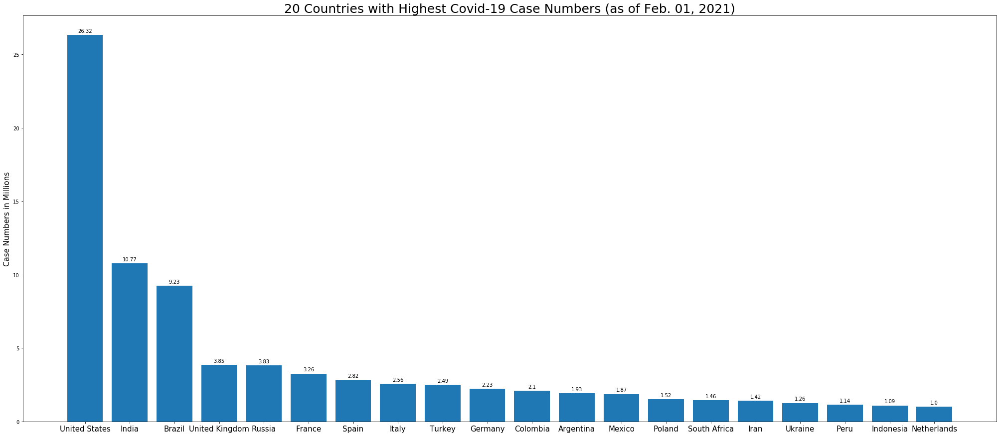
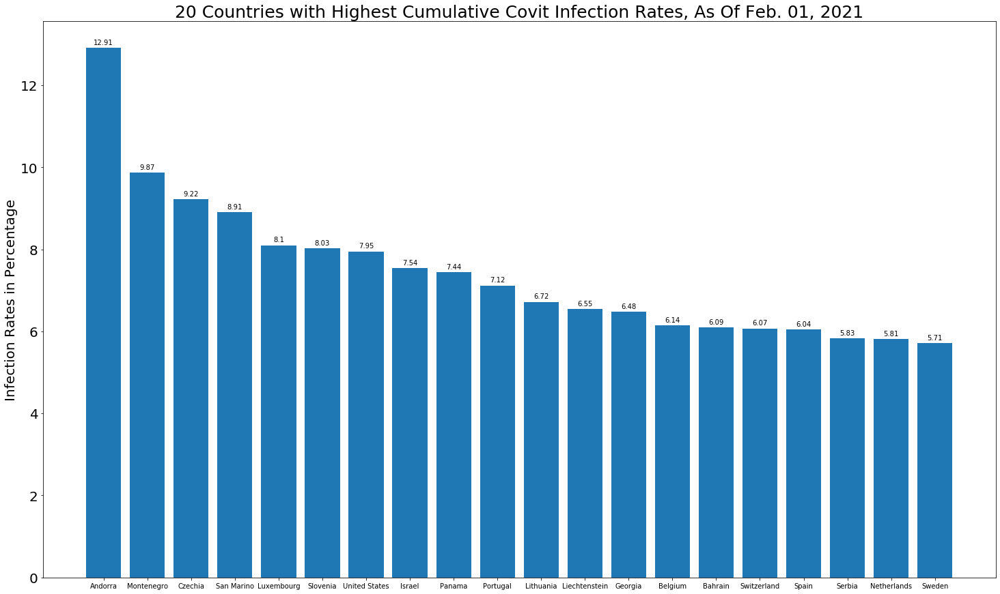
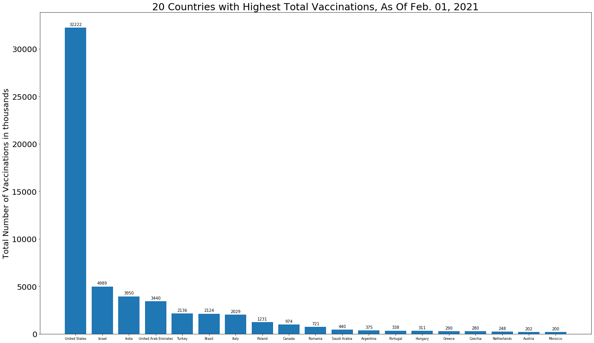
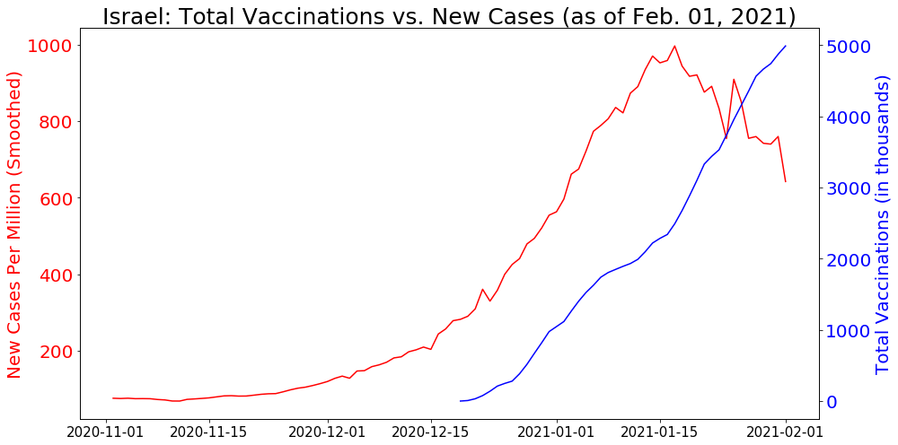
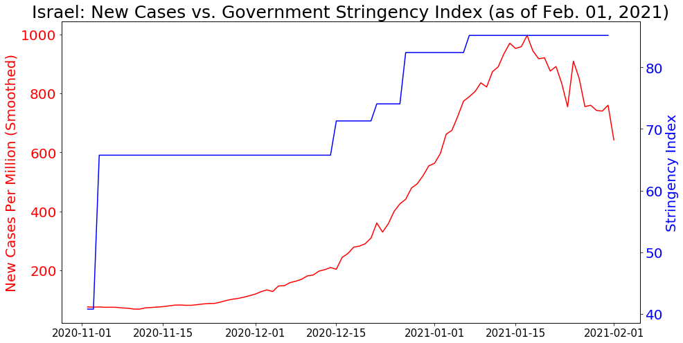
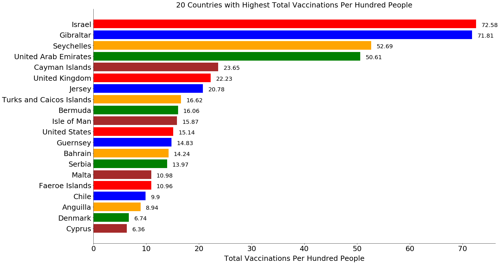
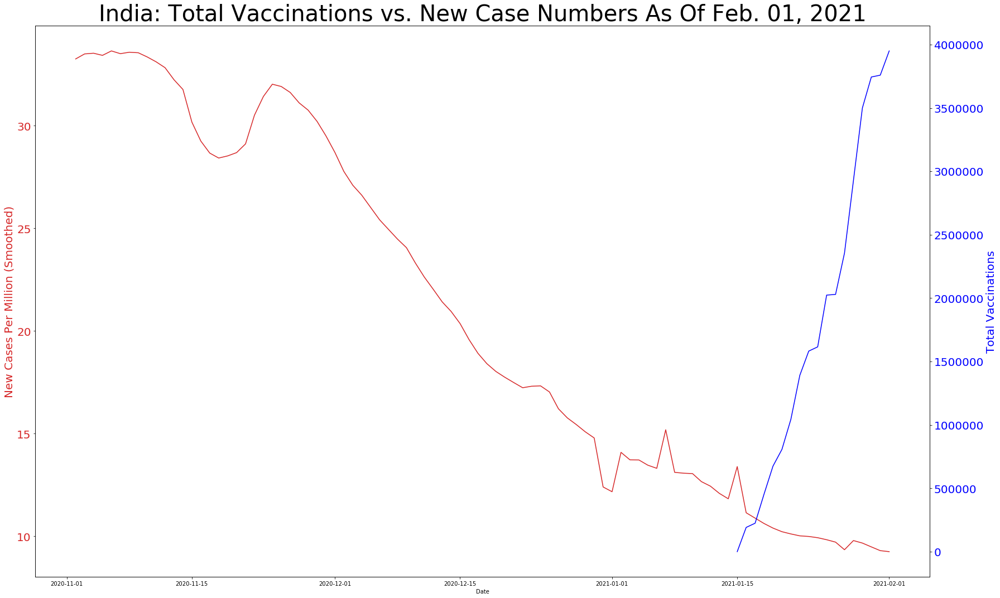
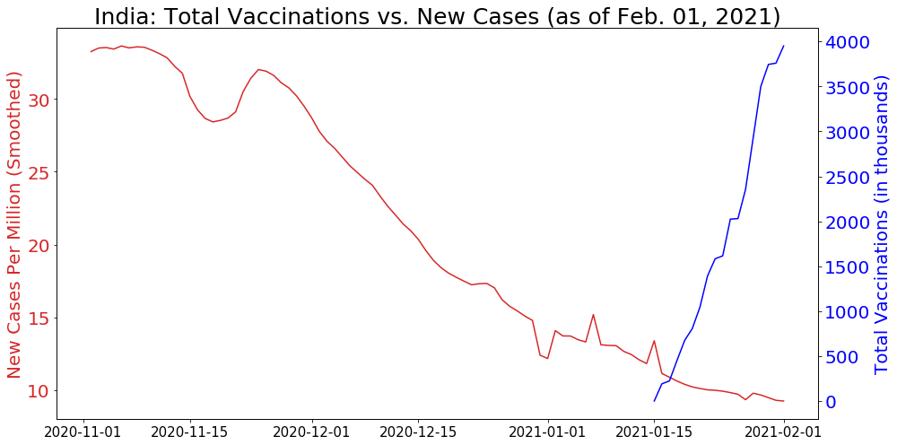
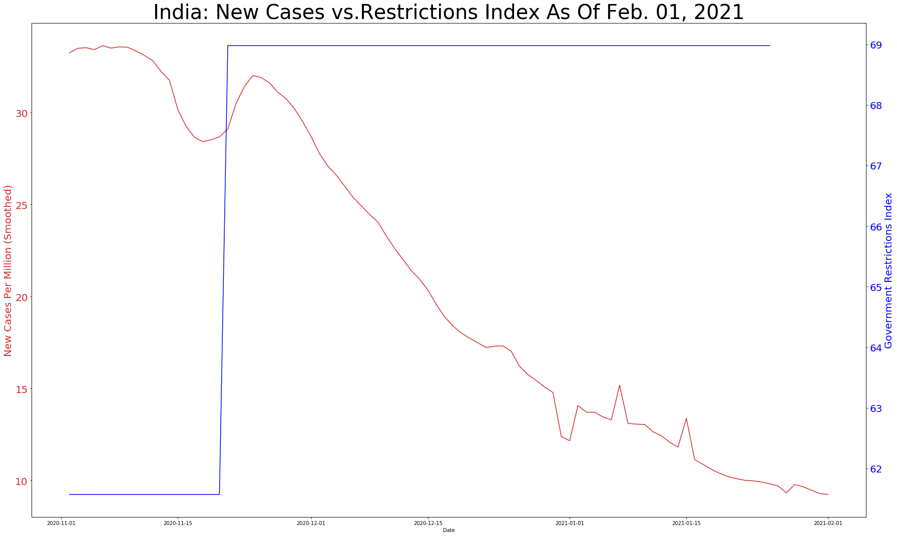

# Analysis on Covit Pandemic


```python
### Data source: One World In Data
```


```python
import pandas as pd
```


```python
import numpy as np
```


```python
import matplotlib.pyplot as plt
%matplotlib inline
```


```python
data = pd.read_csv('/Users/sz/Desktop/Desktop-Docs/DataAnalytics/My-Projects/Covit/owid-covid-data.csv',header=0)
```

## Data Profile


```python
data.describe()
```


<div>
<style scoped>
    .dataframe tbody tr th:only-of-type {
        vertical-align: middle;
    }

    .dataframe tbody tr th {
        vertical-align: top;
    }

    .dataframe thead th {
        text-align: right;
    }
</style>
<table border="1" class="dataframe">
  <thead>
    <tr style="text-align: right;">
      <th></th>
      <th>total_cases</th>
      <th>new_cases</th>
      <th>new_cases_smoothed</th>
      <th>total_deaths</th>
      <th>new_deaths</th>
      <th>new_deaths_smoothed</th>
      <th>total_cases_per_million</th>
      <th>new_cases_per_million</th>
      <th>new_cases_smoothed_per_million</th>
      <th>total_deaths_per_million</th>
      <th>...</th>
      <th>gdp_per_capita</th>
      <th>extreme_poverty</th>
      <th>cardiovasc_death_rate</th>
      <th>diabetes_prevalence</th>
      <th>female_smokers</th>
      <th>male_smokers</th>
      <th>handwashing_facilities</th>
      <th>hospital_beds_per_thousand</th>
      <th>life_expectancy</th>
      <th>human_development_index</th>
    </tr>
  </thead>
  <tbody>
    <tr>
      <th>count</th>
      <td>6.298100e+04</td>
      <td>62973.000000</td>
      <td>62014.000000</td>
      <td>5.435500e+04</td>
      <td>54353.000000</td>
      <td>62014.000000</td>
      <td>62620.000000</td>
      <td>62612.000000</td>
      <td>61658.000000</td>
      <td>54007.000000</td>
      <td>...</td>
      <td>60519.000000</td>
      <td>41407.000000</td>
      <td>61136.000000</td>
      <td>61855.000000</td>
      <td>48218.000000</td>
      <td>47557.000000</td>
      <td>30647.000000</td>
      <td>56125.000000</td>
      <td>62888.000000</td>
      <td>60792.000000</td>
    </tr>
    <tr>
      <th>mean</th>
      <td>3.384117e+05</td>
      <td>3258.502946</td>
      <td>3261.466660</td>
      <td>1.060997e+04</td>
      <td>82.361489</td>
      <td>71.032858</td>
      <td>5901.709885</td>
      <td>61.113100</td>
      <td>61.061763</td>
      <td>144.227522</td>
      <td>...</td>
      <td>19146.470327</td>
      <td>13.202171</td>
      <td>256.609739</td>
      <td>7.773266</td>
      <td>10.573166</td>
      <td>32.643552</td>
      <td>51.092272</td>
      <td>3.041039</td>
      <td>73.126624</td>
      <td>0.715427</td>
    </tr>
    <tr>
      <th>std</th>
      <td>3.335430e+06</td>
      <td>28776.932431</td>
      <td>28529.570877</td>
      <td>8.539574e+04</td>
      <td>616.911662</td>
      <td>557.121687</td>
      <td>11962.999243</td>
      <td>164.730147</td>
      <td>138.867240</td>
      <td>266.027466</td>
      <td>...</td>
      <td>19656.201436</td>
      <td>19.893359</td>
      <td>118.154196</td>
      <td>3.903974</td>
      <td>10.417724</td>
      <td>13.455715</td>
      <td>31.772366</td>
      <td>2.470761</td>
      <td>7.547171</td>
      <td>0.153741</td>
    </tr>
    <tr>
      <th>min</th>
      <td>1.000000e+00</td>
      <td>-46076.000000</td>
      <td>-1121.714000</td>
      <td>1.000000e+00</td>
      <td>-1918.000000</td>
      <td>-232.143000</td>
      <td>0.001000</td>
      <td>-2153.437000</td>
      <td>-276.825000</td>
      <td>0.001000</td>
      <td>...</td>
      <td>661.240000</td>
      <td>0.100000</td>
      <td>79.370000</td>
      <td>0.990000</td>
      <td>0.100000</td>
      <td>7.700000</td>
      <td>1.188000</td>
      <td>0.100000</td>
      <td>53.280000</td>
      <td>0.354000</td>
    </tr>
    <tr>
      <th>25%</th>
      <td>5.310000e+02</td>
      <td>1.000000</td>
      <td>4.571000</td>
      <td>2.900000e+01</td>
      <td>0.000000</td>
      <td>0.000000</td>
      <td>111.857000</td>
      <td>0.084000</td>
      <td>0.860000</td>
      <td>4.952000</td>
      <td>...</td>
      <td>4541.795000</td>
      <td>0.500000</td>
      <td>167.295000</td>
      <td>5.290000</td>
      <td>1.900000</td>
      <td>21.600000</td>
      <td>20.859000</td>
      <td>1.300000</td>
      <td>67.440000</td>
      <td>0.590000</td>
    </tr>
    <tr>
      <th>50%</th>
      <td>5.557000e+03</td>
      <td>46.000000</td>
      <td>55.286000</td>
      <td>1.700000e+02</td>
      <td>1.000000</td>
      <td>0.714000</td>
      <td>868.929000</td>
      <td>5.154500</td>
      <td>6.959000</td>
      <td>25.346000</td>
      <td>...</td>
      <td>13111.214000</td>
      <td>2.000000</td>
      <td>242.648000</td>
      <td>7.110000</td>
      <td>6.300000</td>
      <td>31.400000</td>
      <td>49.839000</td>
      <td>2.400000</td>
      <td>74.530000</td>
      <td>0.747000</td>
    </tr>
    <tr>
      <th>75%</th>
      <td>5.752600e+04</td>
      <td>514.000000</td>
      <td>536.286000</td>
      <td>1.561000e+03</td>
      <td>12.000000</td>
      <td>9.000000</td>
      <td>5358.738250</td>
      <td>47.227000</td>
      <td>52.329000</td>
      <td>137.000500</td>
      <td>...</td>
      <td>27216.445000</td>
      <td>21.200000</td>
      <td>325.721000</td>
      <td>10.080000</td>
      <td>19.300000</td>
      <td>41.100000</td>
      <td>83.241000</td>
      <td>4.000000</td>
      <td>78.570000</td>
      <td>0.843000</td>
    </tr>
    <tr>
      <th>max</th>
      <td>1.034226e+08</td>
      <td>852678.000000</td>
      <td>736396.714000</td>
      <td>2.238315e+06</td>
      <td>17483.000000</td>
      <td>14312.429000</td>
      <td>129062.318000</td>
      <td>8652.658000</td>
      <td>2648.773000</td>
      <td>1974.188000</td>
      <td>...</td>
      <td>116935.600000</td>
      <td>77.600000</td>
      <td>724.417000</td>
      <td>30.530000</td>
      <td>44.000000</td>
      <td>78.100000</td>
      <td>98.999000</td>
      <td>13.800000</td>
      <td>86.750000</td>
      <td>0.953000</td>
    </tr>
  </tbody>
</table>
<p>8 rows × 54 columns</p>
</div>


```python
data.info()
```

    <class 'pandas.core.frame.DataFrame'>
    RangeIndex: 63574 entries, 0 to 63573
    Data columns (total 59 columns):
     #   Column                                 Non-Null Count  Dtype  
    ---  ------                                 --------------  -----  
     0   iso_code                               63213 non-null  object 
     1   continent                              62836 non-null  object 
     2   location                               63574 non-null  object 
     3   date                                   63574 non-null  object 
     4   total_cases                            62981 non-null  float64
     5   new_cases                              62973 non-null  float64
     6   new_cases_smoothed                     62014 non-null  float64
     7   total_deaths                           54355 non-null  float64
     8   new_deaths                             54353 non-null  float64
     9   new_deaths_smoothed                    62014 non-null  float64
     10  total_cases_per_million                62620 non-null  float64
     11  new_cases_per_million                  62612 non-null  float64
     12  new_cases_smoothed_per_million         61658 non-null  float64
     13  total_deaths_per_million               54007 non-null  float64
     14  new_deaths_per_million                 54005 non-null  float64
     15  new_deaths_smoothed_per_million        61658 non-null  float64
     16  reproduction_rate                      51295 non-null  float64
     17  icu_patients                           7012 non-null   float64
     18  icu_patients_per_million               7012 non-null   float64
     19  hosp_patients                          8324 non-null   float64
     20  hosp_patients_per_million              8324 non-null   float64
     21  weekly_icu_admissions                  693 non-null    float64
     22  weekly_icu_admissions_per_million      693 non-null    float64
     23  weekly_hosp_admissions                 1061 non-null   float64
     24  weekly_hosp_admissions_per_million     1061 non-null   float64
     25  total_tests                            29551 non-null  float64
     26  new_tests                              29757 non-null  float64
     27  total_tests_per_thousand               29551 non-null  float64
     28  new_tests_per_thousand                 29757 non-null  float64
     29  new_tests_smoothed                     33539 non-null  float64
     30  new_tests_smoothed_per_thousand        33539 non-null  float64
     31  positive_rate                          31731 non-null  float64
     32  tests_per_case                         31212 non-null  float64
     33  tests_units                            34758 non-null  object 
     34  total_vaccinations                     1205 non-null   float64
     35  people_vaccinated                      937 non-null    float64
     36  people_fully_vaccinated                468 non-null    float64
     37  new_vaccinations                       999 non-null    float64
     38  new_vaccinations_smoothed              1665 non-null   float64
     39  total_vaccinations_per_hundred         1205 non-null   float64
     40  people_vaccinated_per_hundred          937 non-null    float64
     41  people_fully_vaccinated_per_hundred    468 non-null    float64
     42  new_vaccinations_smoothed_per_million  1665 non-null   float64
     43  stringency_index                       57277 non-null  float64
     44  population                             63213 non-null  float64
     45  population_density                     61877 non-null  float64
     46  median_age                             60475 non-null  float64
     47  aged_65_older                          59775 non-null  float64
     48  aged_70_older                          60133 non-null  float64
     49  gdp_per_capita                         60519 non-null  float64
     50  extreme_poverty                        41407 non-null  float64
     51  cardiovasc_death_rate                  61136 non-null  float64
     52  diabetes_prevalence                    61855 non-null  float64
     53  female_smokers                         48218 non-null  float64
     54  male_smokers                           47557 non-null  float64
     55  handwashing_facilities                 30647 non-null  float64
     56  hospital_beds_per_thousand             56125 non-null  float64
     57  life_expectancy                        62888 non-null  float64
     58  human_development_index                60792 non-null  float64
    dtypes: float64(54), object(5)
    memory usage: 28.6+ MB


# change data type to date


```python
import datetime as dt
```


```python
data['date']=pd.to_datetime(data['date'], format='%Y/%m/%d')
```


```python
data['date'].min()
```


    Timestamp('2020-01-01 00:00:00')


```python
data['date'].max()
```


    Timestamp('2021-02-01 00:00:00')


## check duplated entries 


```python
data.duplicated().sum()
```


    0


## check unique values


```python
data['location'].unique()
```


    array(['Afghanistan', 'Albania', 'Algeria', 'Andorra', 'Angola',
           'Antigua and Barbuda', 'Argentina', 'Armenia', 'Australia',
           'Austria', 'Azerbaijan', 'Bahamas', 'Bahrain', 'Bangladesh',
           'Barbados', 'Belarus', 'Belgium', 'Belize', 'Benin', 'Bhutan',
           'Bolivia', 'Bosnia and Herzegovina', 'Botswana', 'Brazil',
           'Brunei', 'Bulgaria', 'Burkina Faso', 'Burundi', 'Cambodia',
           'Cameroon', 'Canada', 'Cape Verde', 'Central African Republic',
           'Chad', 'Chile', 'China', 'Colombia', 'Comoros', 'Congo',
           'Costa Rica', "Cote d'Ivoire", 'Croatia', 'Cuba', 'Cyprus',
           'Czechia', 'Democratic Republic of Congo', 'Denmark', 'Djibouti',
           'Dominica', 'Dominican Republic', 'Ecuador', 'Egypt',
           'El Salvador', 'Equatorial Guinea', 'Eritrea', 'Estonia',
           'Eswatini', 'Ethiopia', 'Fiji', 'Finland', 'France', 'Gabon',
           'Gambia', 'Georgia', 'Germany', 'Ghana', 'Greece', 'Grenada',
           'Guatemala', 'Guinea', 'Guinea-Bissau', 'Guyana', 'Haiti',
           'Honduras', 'Hong Kong', 'Hungary', 'Iceland', 'India',
           'Indonesia', 'International', 'Iran', 'Iraq', 'Ireland', 'Israel',
           'Italy', 'Jamaica', 'Japan', 'Jordan', 'Kazakhstan', 'Kenya',
           'Kosovo', 'Kuwait', 'Kyrgyzstan', 'Laos', 'Latvia', 'Lebanon',
           'Lesotho', 'Liberia', 'Libya', 'Liechtenstein', 'Lithuania',
           'Luxembourg', 'Madagascar', 'Malawi', 'Malaysia', 'Maldives',
           'Mali', 'Malta', 'Marshall Islands', 'Mauritania', 'Mauritius',
           'Mexico', 'Micronesia (country)', 'Moldova', 'Monaco', 'Mongolia',
           'Montenegro', 'Morocco', 'Mozambique', 'Myanmar', 'Namibia',
           'Nepal', 'Netherlands', 'New Zealand', 'Nicaragua', 'Niger',
           'Nigeria', 'North Macedonia', 'Norway', 'Oman', 'Pakistan',
           'Palestine', 'Panama', 'Papua New Guinea', 'Paraguay', 'Peru',
           'Philippines', 'Poland', 'Portugal', 'Qatar', 'Romania', 'Russia',
           'Rwanda', 'Saint Kitts and Nevis', 'Saint Lucia',
           'Saint Vincent and the Grenadines', 'Samoa', 'San Marino',
           'Sao Tome and Principe', 'Saudi Arabia', 'Senegal', 'Serbia',
           'Seychelles', 'Sierra Leone', 'Singapore', 'Slovakia', 'Slovenia',
           'Solomon Islands', 'Somalia', 'South Africa', 'South Korea',
           'South Sudan', 'Spain', 'Sri Lanka', 'Sudan', 'Suriname', 'Sweden',
           'Switzerland', 'Syria', 'Taiwan', 'Tajikistan', 'Tanzania',
           'Thailand', 'Timor', 'Togo', 'Trinidad and Tobago', 'Tunisia',
           'Turkey', 'Uganda', 'Ukraine', 'United Arab Emirates',
           'United Kingdom', 'United States', 'Uruguay', 'Uzbekistan',
           'Vanuatu', 'Vatican', 'Venezuela', 'Vietnam', 'World', 'Yemen',
           'Zambia', 'Zimbabwe'], dtype=object)


## check na percentages


```python
data.isna().sum()/len(data)*100
```


    iso_code                                  0.567842
    continent                                 1.160852
    location                                  0.000000
    date                                      0.000000
    total_cases                               0.932771
    new_cases                                 0.945355
    new_cases_smoothed                        2.453833
    total_deaths                             14.501211
    new_deaths                               14.504357
    new_deaths_smoothed                       2.453833
    total_cases_per_million                   1.500613
    new_cases_per_million                     1.513197
    new_cases_smoothed_per_million            3.013811
    total_deaths_per_million                 15.048605
    new_deaths_per_million                   15.051751
    new_deaths_smoothed_per_million           3.013811
    reproduction_rate                        19.314500
    icu_patients                             88.970334
    icu_patients_per_million                 88.970334
    hosp_patients                            86.906597
    hosp_patients_per_million                86.906597
    weekly_icu_admissions                    98.909932
    weekly_icu_admissions_per_million        98.909932
    weekly_hosp_admissions                   98.331079
    weekly_hosp_admissions_per_million       98.331079
    total_tests                              53.517161
    new_tests                                53.193129
    total_tests_per_thousand                 53.517161
    new_tests_per_thousand                   53.193129
    new_tests_smoothed                       47.244156
    new_tests_smoothed_per_thousand          47.244156
    positive_rate                            50.088086
    tests_per_case                           50.904458
    tests_units                              45.326706
    total_vaccinations                       98.104571
    people_vaccinated                        98.526127
    people_fully_vaccinated                  99.263850
    new_vaccinations                         98.428603
    new_vaccinations_smoothed                97.381005
    total_vaccinations_per_hundred           98.104571
    people_vaccinated_per_hundred            98.526127
    people_fully_vaccinated_per_hundred      99.263850
    new_vaccinations_smoothed_per_million    97.381005
    stringency_index                          9.904993
    population                                0.567842
    population_density                        2.669330
    median_age                                4.874634
    aged_65_older                             5.975713
    aged_70_older                             5.412590
    gdp_per_capita                            4.805424
    extreme_poverty                          34.868028
    cardiovasc_death_rate                     3.834901
    diabetes_prevalence                       2.703936
    female_smokers                           24.154529
    male_smokers                             25.194262
    handwashing_facilities                   51.793186
    hospital_beds_per_thousand               11.717054
    life_expectancy                           1.079057
    human_development_index                   4.376003
    dtype: float64


# Exploratory Analysis

# Top 20 countries with highest case numbers 


```python
sorted = data.loc[data['date']==data['date'].max(), ['date','location', 'total_cases']].sort_values(by ='total_cases', ascending = False)
```


```python
sorted.head(21)
```


<div>
<style scoped>
    .dataframe tbody tr th:only-of-type {
        vertical-align: middle;
    }

    .dataframe tbody tr th {
        vertical-align: top;
    }

    .dataframe thead th {
        text-align: right;
    }
</style>
<table border="1" class="dataframe">
  <thead>
    <tr style="text-align: right;">
      <th></th>
      <th>date</th>
      <th>location</th>
      <th>total_cases</th>
    </tr>
  </thead>
  <tbody>
    <tr>
      <th>62635</th>
      <td>2021-02-01</td>
      <td>World</td>
      <td>103422636.0</td>
    </tr>
    <tr>
      <th>60490</th>
      <td>2021-02-01</td>
      <td>United States</td>
      <td>26321120.0</td>
    </tr>
    <tr>
      <th>26006</th>
      <td>2021-02-01</td>
      <td>India</td>
      <td>10766245.0</td>
    </tr>
    <tr>
      <th>8102</th>
      <td>2021-02-01</td>
      <td>Brazil</td>
      <td>9229322.0</td>
    </tr>
    <tr>
      <th>60113</th>
      <td>2021-02-01</td>
      <td>United Kingdom</td>
      <td>3846851.0</td>
    </tr>
    <tr>
      <th>47042</th>
      <td>2021-02-01</td>
      <td>Russia</td>
      <td>3825739.0</td>
    </tr>
    <tr>
      <th>20557</th>
      <td>2021-02-01</td>
      <td>France</td>
      <td>3260308.0</td>
    </tr>
    <tr>
      <th>53622</th>
      <td>2021-02-01</td>
      <td>Spain</td>
      <td>2822805.0</td>
    </tr>
    <tr>
      <th>28452</th>
      <td>2021-02-01</td>
      <td>Italy</td>
      <td>2560957.0</td>
    </tr>
    <tr>
      <th>58721</th>
      <td>2021-02-01</td>
      <td>Turkey</td>
      <td>2485182.0</td>
    </tr>
    <tr>
      <th>21918</th>
      <td>2021-02-01</td>
      <td>Germany</td>
      <td>2232327.0</td>
    </tr>
    <tr>
      <th>12496</th>
      <td>2021-02-01</td>
      <td>Colombia</td>
      <td>2104506.0</td>
    </tr>
    <tr>
      <th>2396</th>
      <td>2021-02-01</td>
      <td>Argentina</td>
      <td>1933853.0</td>
    </tr>
    <tr>
      <th>37240</th>
      <td>2021-02-01</td>
      <td>Mexico</td>
      <td>1869708.0</td>
    </tr>
    <tr>
      <th>45651</th>
      <td>2021-02-01</td>
      <td>Poland</td>
      <td>1515889.0</td>
    </tr>
    <tr>
      <th>52574</th>
      <td>2021-02-01</td>
      <td>South Africa</td>
      <td>1456309.0</td>
    </tr>
    <tr>
      <th>27053</th>
      <td>2021-02-01</td>
      <td>Iran</td>
      <td>1424596.0</td>
    </tr>
    <tr>
      <th>59375</th>
      <td>2021-02-01</td>
      <td>Ukraine</td>
      <td>1263833.0</td>
    </tr>
    <tr>
      <th>44947</th>
      <td>2021-02-01</td>
      <td>Peru</td>
      <td>1138239.0</td>
    </tr>
    <tr>
      <th>26343</th>
      <td>2021-02-01</td>
      <td>Indonesia</td>
      <td>1089308.0</td>
    </tr>
    <tr>
      <th>40606</th>
      <td>2021-02-01</td>
      <td>Netherlands</td>
      <td>995300.0</td>
    </tr>
  </tbody>
</table>
</div>


## bar charts

## create value series


```python
top_20_countries = sorted['location'][1:].head(20)
top_20_cases = round(sorted['total_cases'][1:].head(20)/1000000, 2)
```

## create bar chart


```python
fig,ax = plt.subplots(figsize = (25,15))
rect = ax.bar(top_20_countries, top_20_cases)
ax.set_title("20 Countries with Highest Covit Case Numbers, As Of Feb. 01, 2021", fontsize = 25)
ax.set_ylabel('Case Numbers in Millions', fontsize = 15)
def autolabel(rects):
    """Attach a text label above each bar in *rects*, displaying its height."""
    for rect in rects:
        height = rect.get_height()
        ax.annotate('{}'.format(height),
                    xy=(rect.get_x() + rect.get_width() / 2, height),
                    xytext=(0, 3),  # 3 points vertical offset
                    textcoords="offset points",
                    ha='center', va='bottom')
autolabel(rect)
```





# Top 20 countries with highest cumulative infection rates


```python
sorted_pop = data.loc[data['date']==data['date'].max(), ['date', 'location','total_cases', 'population']]
```


```python
sorted_pop['rate'] = round(sorted_pop['total_cases']/sorted_pop['population']*100,2)
```


```python
sorted_pop.sort_values(by='rate', ascending = False).head(20)
```


<div>
<style scoped>
    .dataframe tbody tr th:only-of-type {
        vertical-align: middle;
    }

    .dataframe tbody tr th {
        vertical-align: top;
    }

    .dataframe thead th {
        text-align: right;
    }
</style>
<table border="1" class="dataframe">
  <thead>
    <tr style="text-align: right;">
      <th></th>
      <th>date</th>
      <th>location</th>
      <th>total_cases</th>
      <th>population</th>
      <th>rate</th>
    </tr>
  </thead>
  <tbody>
    <tr>
      <th>1353</th>
      <td>2021-02-01</td>
      <td>Andorra</td>
      <td>9972.0</td>
      <td>77265.0</td>
      <td>12.91</td>
    </tr>
    <tr>
      <th>38573</th>
      <td>2021-02-01</td>
      <td>Montenegro</td>
      <td>61972.0</td>
      <td>628062.0</td>
      <td>9.87</td>
    </tr>
    <tr>
      <th>15101</th>
      <td>2021-02-01</td>
      <td>Czechia</td>
      <td>987329.0</td>
      <td>10708982.0</td>
      <td>9.22</td>
    </tr>
    <tr>
      <th>48748</th>
      <td>2021-02-01</td>
      <td>San Marino</td>
      <td>3025.0</td>
      <td>33938.0</td>
      <td>8.91</td>
    </tr>
    <tr>
      <th>34089</th>
      <td>2021-02-01</td>
      <td>Luxembourg</td>
      <td>50733.0</td>
      <td>625976.0</td>
      <td>8.10</td>
    </tr>
    <tr>
      <th>51777</th>
      <td>2021-02-01</td>
      <td>Slovenia</td>
      <td>166836.0</td>
      <td>2078932.0</td>
      <td>8.03</td>
    </tr>
    <tr>
      <th>60490</th>
      <td>2021-02-01</td>
      <td>United States</td>
      <td>26321120.0</td>
      <td>331002647.0</td>
      <td>7.95</td>
    </tr>
    <tr>
      <th>28084</th>
      <td>2021-02-01</td>
      <td>Israel</td>
      <td>652246.0</td>
      <td>8655541.0</td>
      <td>7.54</td>
    </tr>
    <tr>
      <th>43963</th>
      <td>2021-02-01</td>
      <td>Panama</td>
      <td>321103.0</td>
      <td>4314768.0</td>
      <td>7.44</td>
    </tr>
    <tr>
      <th>45993</th>
      <td>2021-02-01</td>
      <td>Portugal</td>
      <td>726321.0</td>
      <td>10196707.0</td>
      <td>7.12</td>
    </tr>
    <tr>
      <th>33745</th>
      <td>2021-02-01</td>
      <td>Lithuania</td>
      <td>182898.0</td>
      <td>2722291.0</td>
      <td>6.72</td>
    </tr>
    <tr>
      <th>33405</th>
      <td>2021-02-01</td>
      <td>Liechtenstein</td>
      <td>2497.0</td>
      <td>38137.0</td>
      <td>6.55</td>
    </tr>
    <tr>
      <th>21546</th>
      <td>2021-02-01</td>
      <td>Georgia</td>
      <td>258351.0</td>
      <td>3989175.0</td>
      <td>6.48</td>
    </tr>
    <tr>
      <th>5817</th>
      <td>2021-02-01</td>
      <td>Belgium</td>
      <td>711417.0</td>
      <td>11589616.0</td>
      <td>6.14</td>
    </tr>
    <tr>
      <th>4455</th>
      <td>2021-02-01</td>
      <td>Bahrain</td>
      <td>103582.0</td>
      <td>1701583.0</td>
      <td>6.09</td>
    </tr>
    <tr>
      <th>55385</th>
      <td>2021-02-01</td>
      <td>Switzerland</td>
      <td>525095.0</td>
      <td>8654618.0</td>
      <td>6.07</td>
    </tr>
    <tr>
      <th>53622</th>
      <td>2021-02-01</td>
      <td>Spain</td>
      <td>2822805.0</td>
      <td>46754783.0</td>
      <td>6.04</td>
    </tr>
    <tr>
      <th>50069</th>
      <td>2021-02-01</td>
      <td>Serbia</td>
      <td>397002.0</td>
      <td>6804596.0</td>
      <td>5.83</td>
    </tr>
    <tr>
      <th>40606</th>
      <td>2021-02-01</td>
      <td>Netherlands</td>
      <td>995300.0</td>
      <td>17134873.0</td>
      <td>5.81</td>
    </tr>
    <tr>
      <th>55010</th>
      <td>2021-02-01</td>
      <td>Sweden</td>
      <td>576606.0</td>
      <td>10099270.0</td>
      <td>5.71</td>
    </tr>
  </tbody>
</table>
</div>


```python
sorted_result=sorted_pop.sort_values(by='rate', ascending = False).head(20)
```


```python
top_20rate_countries=sorted_result['location']
top_20rate_values = sorted_result['rate']
```


```python
fig,ax = plt.subplots(figsize=(25,15))
rect = ax.bar(top_20rate_countries, top_20rate_values)
ax.set_title("20 Countries with Highest Cumulative Covit Infection Rates, As Of Feb. 01, 2021", fontsize = 25)
ax.set_ylabel('Infection Rates in Percentage', fontsize = 20)
ax.tick_params(axis='y', labelsize = 20)
def autolabel(rects):
    """Attach a text label above each bar in *rects*, displaying its height."""
    for rect in rects:
        height = rect.get_height()
        ax.annotate('{}'.format(height),
                    xy=(rect.get_x() + rect.get_width() / 2, height),
                    xytext=(0, 3),  # 3 points vertical offset
                    textcoords="offset points",
                    ha='center', va='bottom')
autolabel(rect)
```





# Top 20 countries of vaccinations


```python
total_vac = data[['date','location','total_vaccinations', 'new_cases_smoothed_per_million', 'stringency_index']]
```


```python
top_vac = total_vac.loc[total_vac['date']== total_vac['date'].max(), ['date', 'location', 'total_vaccinations']]
```


```python
top_vac_sorted = top_vac.sort_values(by = 'total_vaccinations', ascending = False)
```


```python
top_vac_20 = top_vac_sorted.head(20)
```


```python
top_vac_countries = top_vac_20['location'][1:]   # remove "world" row
top_vac_values = top_vac_20['total_vaccinations'][1:]/1000
top_vac_values = top_vac_values.astype(int)
```


```python
fig,ax = plt.subplots(figsize = (25,15))
rect = ax.bar(top_vac_countries, top_vac_values)
ax.set_title("20 Countries with Highest Total Vaccinations, As Of Feb. 01, 2021", fontsize = 25)
ax.set_ylabel('Total Number of Vaccinations in thousands', fontsize = 20)
ax.tick_params(axis= 'y', labelsize = 20)
ax.tick_params(axis='x', labelsize =8)
def autolabel(rects):
    """Attach a text label above each bar in *rects*, displaying its height."""
    for rect in rects:
        height = rect.get_height()
        ax.annotate('{}'.format(height),
                    xy=(rect.get_x() + rect.get_width() / 2, height),
                    xytext=(0, 3),  # 3 points vertical offset
                    textcoords="offset points",
                    ha='center', va='bottom')
autolabel(rect)
```





# Israel Covit trend after vaccinations


```python
Israel=total_vac.loc[total_vac['location'].isin(['Israel'])]
```


```python
Israel_vac = Israel[Israel['date']>'2020/11/1']

```


```python
fig, ax = plt.subplots(figsize=(25,15))
color = 'red'
ax.set_xlabel('Date')
ax.set_ylabel('New Cases Per Million (Smoothed)', color=color, fontsize = 20)
ax.plot(Israel_vac['date'], Israel_vac['new_cases_smoothed_per_million'], color = color)
ax.tick_params(axis='y', labelcolor=color, labelsize =20)
ax.set_title('Israel: Total Vaccinations vs. New Case Numbers As Of Feb. 01, 2021', fontsize=40)

ax2 = ax.twinx()  # instantiate a second axes that shares the same x-axis

color = 'blue'
ax2.set_ylabel('Total Vaccinations', color=color, fontsize =20)  # we already handled the x-label with ax1
ax2.plot(Israel_vac['date'], Israel_vac['total_vaccinations'], color=color)
ax2.tick_params(axis='y', labelcolor=color, labelsize =20)

fig.tight_layout()  # otherwise the right y-label is slightly clipped
plt.show()
```





# Israel New Cases vs. Restrictions (Stringency) Index


```python
fig, ax = plt.subplots(figsize=(25,15))
color = 'red'
ax.set_xlabel('Date')
ax.set_ylabel('New Cases Per Million (Smoothed)', color=color, fontsize = 20)
ax.plot(Israel_vac['date'], Israel_vac['new_cases_smoothed_per_million'], color = color)
ax.tick_params(axis='y', labelcolor=color, labelsize =20)
ax.set_title('Israel: New Cases vs. Restrictions Index, As Of Feb. 01, 2021', fontsize=40)

ax2 = ax.twinx()  # instantiate a second axes that shares the same x-axis

color = 'blue'
ax2.set_ylabel('Government Restrictions Index', color=color, fontsize =20)  # we already handled the x-label with ax1
ax2.plot(Israel_vac['date'], Israel_vac['stringency_index'], color=color)
ax2.tick_params(axis='y', labelcolor=color, labelsize =20)

fig.tight_layout()  # otherwise the right y-label is slightly clipped
plt.show()
```





# US Covit trend after vaccinations


```python
US = total_vac.loc[total_vac['location'].isin(['United States'])]
```


```python
US_vac = US[US['date']>'2020/11/01']
```


```python
fig, ax = plt.subplots(figsize=(25,15))
color = 'tab:red'
ax.set_xlabel('Date')
ax.set_ylabel('New Cases Per Million (Smoothed)', color=color, fontsize = 20)
ax.plot(US_vac['date'], US_vac['new_cases_smoothed_per_million'], color = color)
ax.tick_params(axis='y', labelcolor=color, labelsize = 20)
ax.set_title('US: Total Vaccinations vs. New Case Numbers As Of Feb. 01, 2021', fontsize=40)

ax2 = ax.twinx()  # instantiate a second axes that shares the same x-axis

color = 'blue'
ax2.set_ylabel('Total Vaccinations', color=color, fontsize =20)  # we already handled the x-label with ax1
ax2.plot(US_vac['date'], US_vac['total_vaccinations'], color=color)
ax2.tick_params(axis='y', labelcolor=color, labelsize = 20)

fig.tight_layout()  # otherwise the right y-label is slightly clipped
plt.show()
```





# US New Cases vs. Restrictions Index


```python
fig, ax = plt.subplots(figsize=(25,15))
color = 'tab:red'
ax.set_xlabel('Date')
ax.set_ylabel('New Cases Per Million (Smoothed)', color=color, fontsize = 20)
ax.plot(US_vac['date'], US_vac['new_cases_smoothed_per_million'], color = color)
ax.tick_params(axis='y', labelcolor=color, labelsize = 20)
ax.set_title('US: New Cases vs. Restrictions Index, As Of Feb. 01, 2021', fontsize=40)

ax2 = ax.twinx()  # instantiate a second axes that shares the same x-axis

color = 'blue'
ax2.set_ylabel('Government Restrictions Index', color=color, fontsize =20)  # we already handled the x-label with ax1
ax2.plot(US_vac['date'], US_vac['stringency_index'], color=color)
ax2.tick_params(axis='y', labelcolor=color, labelsize = 20)

fig.tight_layout()  # otherwise the right y-label is slightly clipped
plt.show()
```





# India Covit trend after vaccinations


```python
India = total_vac.loc[total_vac['location'].isin(['India'])]
```


```python
India_vac = India[India['date']>'2020/11/01']
```


```python
fig, ax = plt.subplots(figsize = (25,15))
color = 'tab:red'
ax.set_xlabel('Date')
ax.set_ylabel('New Cases Per Million (Smoothed)', color=color, fontsize = 20)
ax.plot(India_vac['date'], India_vac['new_cases_smoothed_per_million'], color = color)
ax.tick_params(axis='y', labelcolor=color, labelsize = 20)
ax.set_title('India: Total Vaccinations vs. New Case Numbers As Of Feb. 01, 2021', fontsize=40)

ax2 = ax.twinx()  # instantiate a second axes that shares the same x-axis

color = 'blue'
ax2.set_ylabel('Total Vaccinations', color=color, fontsize =20)  # we already handled the x-label with ax1
ax2.plot(India_vac['date'], India_vac['total_vaccinations'], color=color)
ax2.tick_params(axis='y', labelcolor=color, labelsize = 20)

fig.tight_layout()  # otherwise the right y-label is slightly clipped
plt.show()
```





# India: New Cases vs. Restrictions Index


```python
fig, ax = plt.subplots(figsize = (25,15))
color = 'tab:red'
ax.set_xlabel('Date')
ax.set_ylabel('New Cases Per Million (Smoothed)', color=color, fontsize = 20)
ax.plot(India_vac['date'], India_vac['new_cases_smoothed_per_million'], color = color)
ax.tick_params(axis='y', labelcolor=color, labelsize = 20)
ax.set_title('India: New Cases vs.Restrictions Index As Of Feb. 01, 2021', fontsize=40)

ax2 = ax.twinx()  # instantiate a second axes that shares the same x-axis

color = 'blue'
ax2.set_ylabel('Government Restrictions Index', color=color, fontsize =20)  # we already handled the x-label with ax1
ax2.plot(India_vac['date'], India_vac['stringency_index'], color=color)
ax2.tick_params(axis='y', labelcolor=color, labelsize = 20)

fig.tight_layout()  # otherwise the right y-label is slightly clipped
plt.show()
```





```python

```
